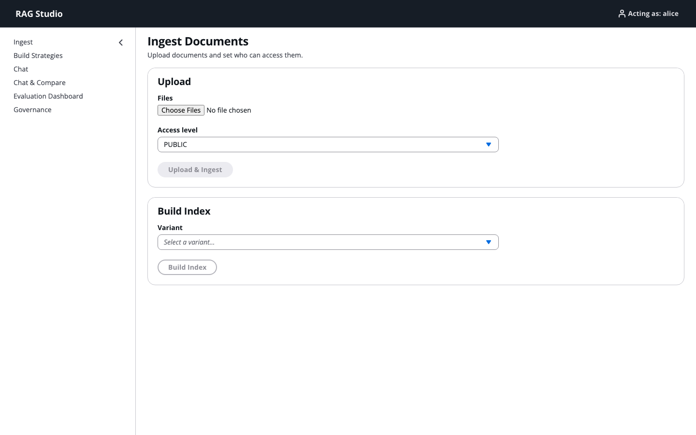
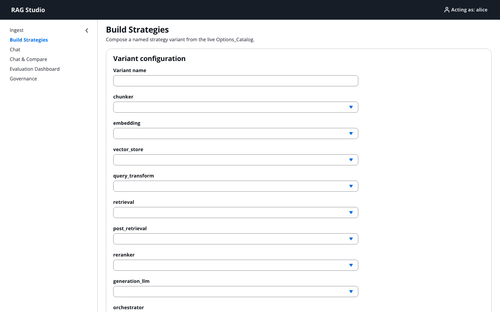
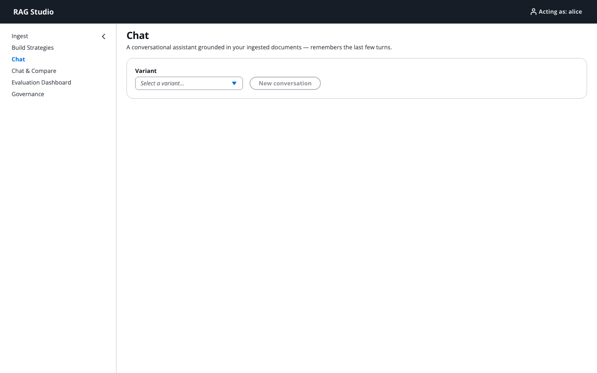
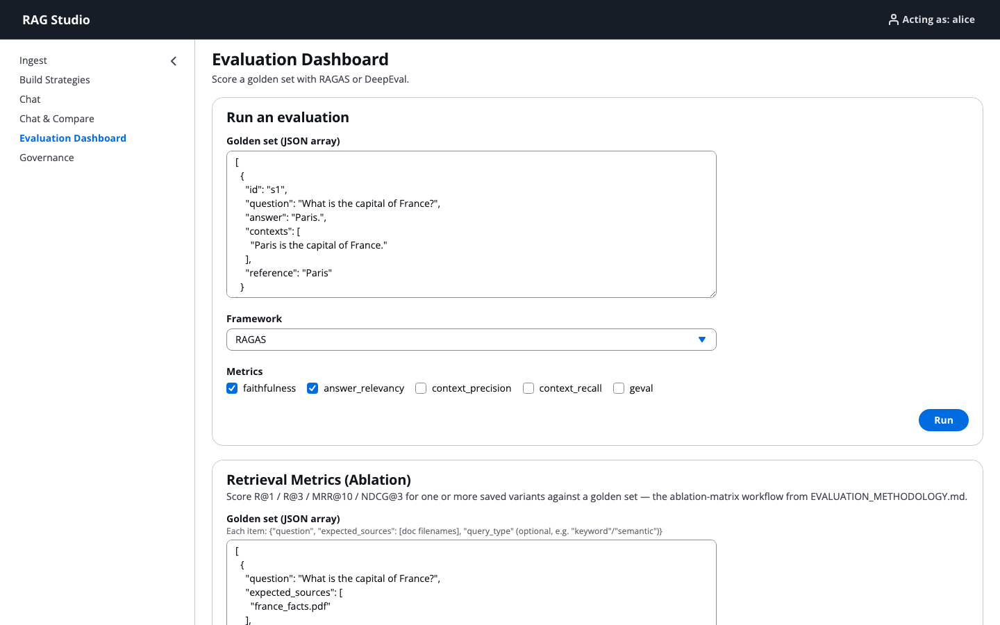

<div align="center">

# RAG Studio

### Session 10 · M08 portfolio

*Swap every stage of a RAG pipeline — then compare strategies on the same question.*

</div>

RAG Studio is a configurable RAG (Retrieval-Augmented Generation) workbench built as
the Session 10 / M08 portfolio project. Every stage of the pipeline — chunking, embeddings, vector
store, query transform, retrieval, post-retrieval, reranking, generation,
orchestration, caching, and guardrails — is a swappable module chosen from a live
Options_Catalog, so you can define named **strategy variants** and compare them
side by side on the same question, with governance-aware access control, tracing,
and RAGAS/DeepEval evaluation built in.

<p align="center">
  
</p>
<p align="center"><em>Ingest — upload files, pick an access level, then build an index for a saved variant.</em></p>

<p align="center">
  
</p>
<p align="center"><em>Build Strategies — swap chunker, embeddings, retrieval, reranker, and generator from the live catalog.</em></p>

<p align="center">
  
</p>
<p align="center"><em>Chat — pick a variant and ask questions grounded in the ingested docs.</em></p>

<p align="center">
  
</p>
<p align="center"><em>Evaluation Dashboard — score a golden set with RAGAS or DeepEval (faithfulness, answer relevancy, retrieval ablation).</em></p>

The project has three tiers:

1. **`rag/`** — a transport-agnostic Python package with no FastAPI/React dependency.
   Fully covered by property-based (`hypothesis`), unit, and integration tests.
2. **`backend/`** — a FastAPI REST/JSON API over `rag.pipeline`.
3. **`frontend/`** — a React + TypeScript SPA (Ingest, Build Strategies,
   Chat & Compare, Evaluation Dashboard, Governance).

## Prerequisites

- Python 3.11+
- Node.js 18+ and npm
- An `OPENAI_API_KEY` for core embedding/generation/judge features (optional keys
  unlock optional providers — see `.env.example`)

## Setup

```bash
# from capstone_rag_studio/
pip install -r requirements.txt
cp .env.example .env        # then fill in OPENAI_API_KEY (and any optional keys)

cd frontend
npm install
cp .env.example .env        # VITE_API_BASE_URL, defaults to http://localhost:8000
cd ..
```

## Running it

Both the backend and frontend are long-running dev servers you start manually, in
two separate terminals. Env_Keys are loaded from `10_RAG/.env` (one directory above
this one) at backend startup.

**Terminal 1 — backend (FastAPI):**

```bash
uvicorn backend.main:app --reload --port 8000
```

**Terminal 2 — frontend (Vite dev server):**

```bash
cd frontend
npm run dev
```

The frontend connects to the backend at whatever `VITE_API_BASE_URL` is set to in
`frontend/.env` (default `http://localhost:8000`) — it never calls any LLM/embedding
provider directly.

Open the URL Vite prints (typically `http://localhost:5173`) and:

1. **Build Strategies** — pick modules per stage, save a named variant.
2. **Ingest** — upload documents with an access level/ACL, then build the index for a
   saved variant.
3. **Chat & Compare** — ask a question against one or more variants, see cited
   answers, per-stage timing, and governance-filtered counts side by side.
4. **Evaluation Dashboard** — run a golden set through RAGAS or DeepEval.
5. **Governance** — switch the Acting_Principal and inspect/edit Access_Policies.

## Running the tests

```bash
# rag package + backend: property, unit, and integration tests (no API key needed —
# all provider I/O is mocked)
pytest

# frontend build
cd frontend && npm run build

# frontend end-to-end (spins up a provider-mocked backend + the Vite dev server)
cd frontend && npm run test:e2e
```

## Evaluation presentation

[▶ RAG strategy evaluation (GitHub Pages)](https://nursnaaz.github.io/zero-to-genai-engineer/10_RAG/capstone_rag_studio/reports/rag_strategy_evaluation_presentation.html)

## The capstone notebook

`capstone.ipynb` exercises the full pipeline **live** (the one place in this project
that makes real provider calls): ingest → governance → retrieve → rerank → generate →
evaluate, run on the `genai2026` Jupyter kernel. It requires a real `OPENAI_API_KEY`
in `10_RAG/.env` and will incur a small amount of real API usage.

## Project layout

```
capstone_rag_studio/
├── rag/                  # transport-agnostic pipeline package
├── backend/               # FastAPI app (main.py, deps.py, errors.py)
├── frontend/               # React + TypeScript SPA
├── tests/                # pytest: property, unit, integration, smoke
├── capstone.ipynb         # live end-to-end capstone notebook
├── requirements.txt
└── .env.example
```

← [Session 10](../README.md)
