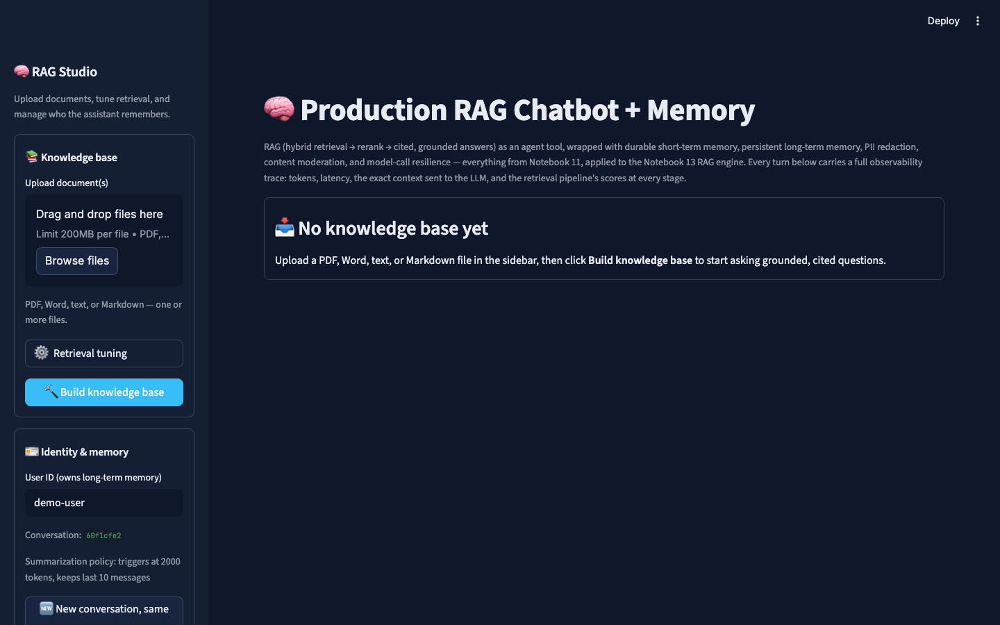

# Production RAG chatbot + memory

Streamlit app built in **Notebook 14**. Reuses `../production_rag_chatbot/rag_pipeline.py` and adds durable conversation memory.

<p align="center">
  
</p>
<p align="center"><em>Same RAG engine as Notebook 13, plus a user id, conversation id, and summarization so the bot remembers across turns.</em></p>

```bash
cd 10_RAG/notebooks/production_rag_chatbot_memory
pip install -r requirements.txt
streamlit run app.py
```

Needs `OPENAI_API_KEY` in `10_RAG/.env`. Finish Notebook 13 first so `production_rag_chatbot/` is in place.

← [Notebooks](../README.md) · [Session 10](../../README.md)
