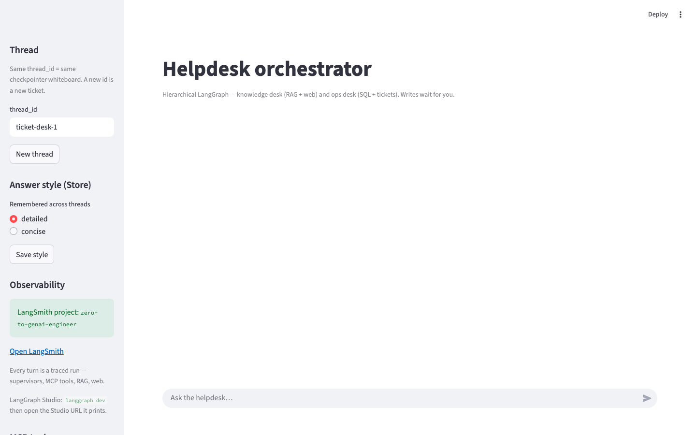

<div align="center">

# Session 11 — LangGraph

### M10 · Stateful agents · Complete

*Turn a straight-line RAG chain into a graph with loops, durable memory, and a pause button.*

[](https://docs.langchain.com/oss/python/langgraph)
[](https://python.langchain.com/)
[](https://www.python.org/)

[Start here](#-start-here) · [Path](#-learning-path) · [Why graphs](#-why-a-graph) · [Apps](#-run-the-apps)

</div>

---

> **What was MISSING from S10:** you shipped a production RAG pipeline — hybrid retrieval, reranking, guardrails, memory. `ProductionRAGChatbot.chat()` is still a **straight line**. It cannot retry a weak retrieval, rewrite a vague question, or pause for a human when it is stuck.
>
> LangGraph is that control flow: **cycles, durable state, and `interrupt()`.**

S10 Notebook 11 already used `create_agent` + middleware for *generic* concerns (memory, approve-this-tool). This session teaches the **primitives** those helpers wrap — so you can build a loop no off-the-shelf middleware covers.

---

## 🚀 Start here

**Before this folder:** Session 10 notebooks **01–11**. Day 3 also needs Notebook **16** (MCP helpdesk).

```bash
# 1. Keys (or reuse 10_RAG/.env)
cp 11_LangGraph/.env.example 11_LangGraph/.env

# 2. Install
cd 11_LangGraph/notebooks
pip install -r requirements.txt

# 3. Open notebook 01
```

Then open [`notebooks/01_langgraph_fundamentals_and_agents.ipynb`](notebooks/01_langgraph_fundamentals_and_agents.ipynb).

**Browser labs:** [ReAct, one tool](https://nursnaaz.github.io/tutorial/one-tool-one-loop) · [Human in the loop](https://nursnaaz.github.io/tutorial/human-in-the-loop) · [MCP as USB](https://nursnaaz.github.io/tutorial/mcp-as-usb) · [Securing agents](https://nursnaaz.github.io/tutorial/secured-agents)

Class slides: [all decks](https://nursnaaz.github.io/zero-to-genai-engineer/). Each day also has a link in the table below. Day 3 is the notebook + Streamlit app.

---

## 🗺️ Learning path

Do **S11a → S11c** in order. Then pick a bonus notebook or a portfolio app.

```text
S11a  Fundamentals & agents     required
  │    StateGraph · ToolNode · create_agent · checkpointer · stream
  ▼
S11b  Human-in-the-loop         required
  │    interrupt() · Command(resume=...) · weather does NOT pause
  ▼
S11c  Multi-agent orchestrator  required
  │    supervisor · RAG-as-tool · SQL/MCP · ticket writes pause
  │
  ├── S11d  Reasoning patterns  bonus (interview map + papers)
  ├── S11e  SQL agent           bonus (Chinook, forced schema lookup)
  ├── capstone_agentic_rag/     optional (self-correcting RAG)
  └── [medium-article-agent](https://github.com/nursnaaz/medium-article-agent)     optional FastAPI + React
```

| Day | Open | What you do | Time |
|---|---|---|---|
| **S11a** | [01 — Fundamentals](notebooks/01_langgraph_fundamentals_and_agents.ipynb) | Draw a graph, wire nodes/edges, build ReAct by hand, then call `create_agent`. [Slides](https://nursnaaz.github.io/zero-to-genai-engineer/11_LangGraph/notebooks/teaching_decks/teach_01_langgraph_fundamentals.html) | ~2 hr |
| **S11b** | [02 — HITL](notebooks/02_human_in_the_loop.ipynb) | Pause a risky tool, type yes/no, resume the same `thread_id`. [Slides](https://nursnaaz.github.io/zero-to-genai-engineer/11_LangGraph/notebooks/teaching_decks/teach_02_human_in_the_loop.html) | ~1 hr |
| **S11c** | [03 — Orchestrator](notebooks/03_multi_agent_orchestrator.ipynb) then [the app](multi_agent_orchestrator/) | Route a ticket to RAG, web, or SQL; block writes until a human approves | ~2 hr |
| **S11d** | [04 — Patterns](notebooks/04_agent_reasoning_patterns_masterclass.ipynb) | Name ReAct / Reflection / Reflexion / REWOO / ToT / Self-Discover and when to use each. [Slides](https://nursnaaz.github.io/zero-to-genai-engineer/11_LangGraph/notebooks/teaching_decks/teach_04_agent_reasoning_patterns.html) | ~2 hr |
| **S11e** | [05 — SQL agent](notebooks/05_sql_agent_langgraph.ipynb) | Force list-tables → schema → check → run on Chinook (downloads DB on first run). [Slides](https://nursnaaz.github.io/zero-to-genai-engineer/11_LangGraph/notebooks/teaching_decks/teach_05_sql_agent.html) | ~1.5 hr |

Full notebook index: [`notebooks/README.md`](notebooks/README.md).

---

## 📂 Folder map

```text
11_LangGraph/
├── README.md                         ← you are here
├── .env.example
├── notebooks/
│   ├── 01_langgraph_fundamentals_and_agents.ipynb
│   ├── 02_human_in_the_loop.ipynb
│   ├── 03_multi_agent_orchestrator.ipynb
│   ├── 04_agent_reasoning_patterns_masterclass.ipynb
│   ├── 05_sql_agent_langgraph.ipynb
│   ├── teaching_decks/               ← HTML slides (Days 1, 2, 4, 5)
│   ├── assets/patterns/              ← architecture diagrams for 04 / 05
│   └── requirements.txt
├── multi_agent_orchestrator/         ← Day 3 Streamlit + LangGraph Studio
└── capstone_agentic_rag/             ← optional self-correcting RAG
```

Sibling portfolio (same LangGraph skills, product UI): [medium-article-agent](https://github.com/nursnaaz/medium-article-agent). Clone that repo; it is not in this course tree.

---

## 💡 Why a graph

An LCEL chain (`prompt | llm | parser`) runs **once, forward, and stops**. Fine for “retrieve then answer.” It breaks when you need:

| Need | Graph primitive |
|---|---|
| “Try the search again” | A **loop** (edge back to retrieve) |
| “If ungrounded, regenerate; if still bad, ask a human” | **Conditional edges** |
| Crash / refresh / come back tomorrow | **Checkpointer** (`thread_id`) |
| Two specialists + a manager | `Command(goto=...)` / `create_supervisor` |
| “Don’t send that email until I say so” | `interrupt()` + `Command(resume=...)` |

Memory, crash recovery, and human-in-the-loop are **the same mechanism**: snapshot state after every node.

### API you will actually type

| Concept | Import | Role |
|---|---|---|
| `StateGraph` | `langgraph.graph` | Schema + nodes + edges + `compile()` |
| `START`, `END` | `langgraph.graph` | Entry / exit |
| `MessagesState` | `langgraph.graph` | Chat history that **appends** |
| `create_agent` | `langchain.agents` | High-level tool-calling agent (built on `StateGraph`) |
| `ToolNode`, `tools_condition` | `langgraph.prebuilt` | Run tools; loop back or finish |
| `Command` | `langgraph.types` | Update state **and** pick the next node |
| `interrupt()` | `langgraph.types` | Pause mid-node for a human |
| `MemorySaver` | `langgraph.checkpoint.memory` | Short-term memory by `thread_id` |
| `InMemoryStore` | `langgraph.store.memory` | Long-term facts across threads |
| `create_supervisor` | `langgraph_supervisor` | Hub-and-spoke multi-agent |

We build the ReAct graph **by hand** in S11a before calling `create_agent`, so the helper is not a black box. `create_react_agent` still works; `create_agent` is what new code should use.

---

## 🖥️ Run the apps

### Day 3 — Hierarchical helpdesk (required)

S10 already has an MCP helpdesk (SQL + RAG). LangGraph puts a **team** on it:

```text
top_supervisor
  ├── knowledge_team → rag_agent (search_knowledge_base) + search_agent (web)
  └── ops_team       → sql_agent (reads) + ticket_agent (writes → interrupt())
```

```bash
cd 11_LangGraph/multi_agent_orchestrator
pip install -r requirements.txt
python3 -m streamlit run app.py
```

Optional IDE: `langgraph dev` (opens LangGraph Studio). Full notes: [`multi_agent_orchestrator/README.md`](multi_agent_orchestrator/README.md).

<p align="center">
  
</p>
<p align="center"><em>Day 3 app — hierarchical teams, RAG + SQL over MCP, writes that pause for you.</em></p>

Try: *“What is our refund policy?”* · *“How many open tickets does Jane Doe have?”* · *“Add a note that we offered a refund”* (then type **yes** or **no**).

### Optional — Self-correcting Agentic RAG

Same S10 `HybridIndex` + `Reranker`, now with grade → rewrite → RAGAS → escalate:

```text
condense → retrieve → grade_documents ──insufficient──► rewrite_query ─┐
                ▲                                                     │
                └─────────────────────────────────────────────────────┘
                       │ sufficient
                       ▼
                  generate → check_groundedness → END
                       │ not grounded, retries left → loop
                       └── retries exhausted → human_escalation (interrupt)
```

```bash
cd 11_LangGraph/capstone_agentic_rag
pip install -r requirements.txt
streamlit run app.py
pytest tests/test_graph.py -v     # no API key — fakes LLM + retriever
```

<p align="center">
  
</p>
<p align="center"><em>Grade → rewrite → groundedness loop, with a human pause when retries run out.</em></p>

### Optional — Medium article agent

Ingest PDF / PPTX / HTML / notebooks → draft → parallel reviewers → HITL → export Markdown. Does not auto-publish to Medium.

**Clone:** [nursnaaz/medium-article-agent](https://github.com/nursnaaz/medium-article-agent)

Python **3.12+**, Node 18+, `OPENAI_API_KEY`. Install and Docker are in that README. It does not use the S11 notebook env.

---

## ⚙️ Setup notes

- Python **3.11+**. Use `python3 -m streamlit` so Streamlit sees the same env as LangGraph.
- `OPENAI_API_KEY` in `11_LangGraph/.env`, `10_RAG/.env`, or the repo root.
- Optional: `TAVILY_API_KEY` (otherwise DuckDuckGo via `ddgs`).
- Notebook 05 downloads `Chinook.db` on first run (gitignored).
- Notebook 03 starts `10_RAG/notebooks/production_mcp_agents_rag_capstone/`.

---

## ➡️ What's next

S11 gives you **control flow**. Memory, MCP, guardrails, and the FastAPI apps are already in S10 / earlier sessions. What's still ahead: CrewAI, dedicated document/code modules, LLMOps, LoRA — see the [root syllabus](../README.md#-where-the-23-module-syllabus-stands).

---

<div align="center">

**Course nav:** [← S10 RAG + Memory](../10_RAG/) · [All sessions](../README.md) · Next: CrewAI (see syllabus)

</div>
