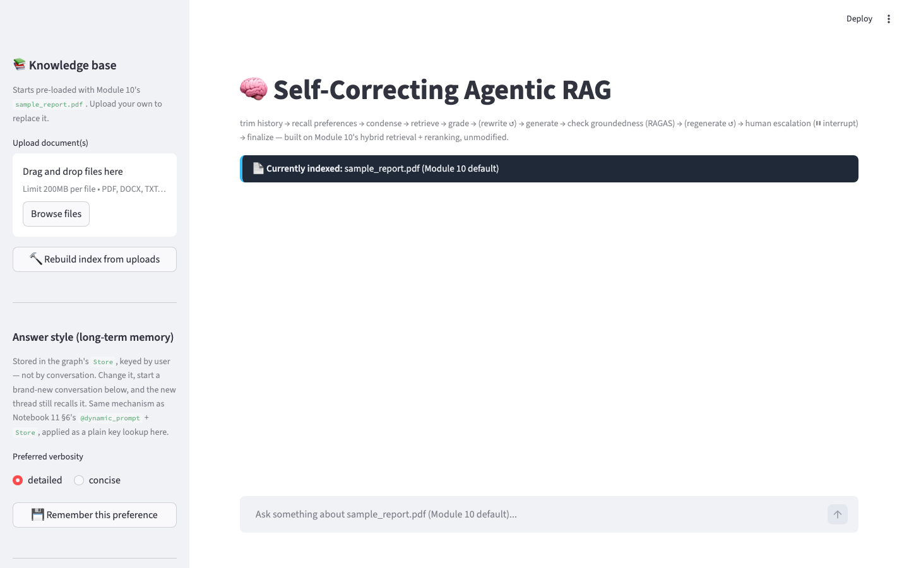

<div align="center">

# Self-Correcting Agentic RAG

### Session 11 · optional portfolio (not Day 3)

*The S10 hybrid pipeline, wrapped in a graph that grades, retries, and escalates.*

</div>

Day 3 (required) is the [helpdesk orchestrator](../notebooks/03_multi_agent_orchestrator.ipynb). This folder is a **side project**.

<p align="center">
  
</p>
<p align="center"><em>Upload a document, chat over it, and watch the graph grade, rewrite, and escalate. Answer style lives in the long-term Store.</em></p>

The teaching notebook for *this* single-agent RAG graph lives at
[`self_correcting_rag.ipynb`](self_correcting_rag.ipynb). The graph is exported as
`graph.py` and wrapped in a Streamlit chat app (`app.py`).

Built on top of Module 10's `ProductionRAGChatbot` pipeline
(`10_RAG/notebooks/production_rag_chatbot/rag_pipeline.py`) — `HybridIndex`, `Reranker`, and
every prompt are imported and reused unmodified. What this app adds is everything a
straight-line chain can't do: retrying a weak retrieval, retrying an ungrounded answer, and
pausing for a human when both retries run out — plus the rest of the Module 10 toolkit,
genuinely wired in rather than referenced:

- **RAGAS Faithfulness** (S10e) scores every generated answer live, with an LLM-judge
  fallback if `ragas` isn't installed
- The **`min_rerank_score` guardrail** from `ProductionRAGChatbot` (Notebook 13) runs as a
  free first-pass filter before the LLM-judge sufficiency check
- **Token-budget trimming** (S10f §5b) caps the stored conversation instead of growing it
  forever
- **Long-term memory (`Store`)** (S10f §6) remembers a per-user answer-style preference
  across brand-new conversations, not just within one thread
- **Resilient LLM calls** (S10f §10) retry with backoff on transient provider errors
- **Structured output** (S10f §11) — export any answer + its sources as a validated
  `{answer, citations: [...]}` object, on demand

## Run it

```bash
pip install -r requirements.txt
cd 11_LangGraph/capstone_agentic_rag
streamlit run app.py
```

Needs `OPENAI_API_KEY` in `11_LangGraph/.env`, `10_RAG/.env`, or the repo root.

## What to try

1. **A normal, in-scope question** — watch the trace: `condense → retrieve → grade_documents
   (sufficient) → generate → check_groundedness (grounded) → finalize`, no retries.
2. **A deliberately vague question** ("tell me about the numbers") — watch
   `grade_documents` come back `insufficient` and the graph loop through `rewrite_query →
   retrieve` before it succeeds.
3. **A genuinely out-of-scope question** ("what's the capital of France?") — watch retries
   exhaust and the graph **pause**: an approval box appears asking a human for guidance
   before the agent will respond at all.
4. **A follow-up with a pronoun** ("what about its risks?") — same conversation thread, so
   `condense` resolves it using durable, checkpointer-backed memory, not a hand-rolled list.
5. Turn on **"Compare against Module 10's straight-line chatbot"** in the sidebar to see the
   exact same question answered two ways, side by side: the chain that always does the same
   four steps, versus the graph that grades, retries, and escalates.
6. Set **"Answer style"** to `concise` in the sidebar and click "Remember this preference,"
   then **start a new conversation** — the fresh thread has never been told your preference,
   yet still answers concisely, because it's reading from the `Store`, not the thread's own
   history.
7. Click **"Extract structured citations"** under any answer to see the same text turned into
   a validated `{answer, citations: [...]}` object — what you'd actually hand to a ticketing
   or citations API instead of parsing the prose yourself.
8. Check the RAGAS score in the caption under any answer (`RAGAS faithfulness: 0.xx`) — the
   same metric from Notebook 09, now gating the answer live instead of scoring it offline.

## Run the tests

```bash
pytest tests/test_graph.py -v
```

No API key or network access needed — the retriever and LLM are faked, so the suite asserts
on the graph's routing decisions (which nodes fired, how many retries, whether it escalated)
in under 3 seconds.

## Files

| File | What it is |
|---|---|
| `graph.py` | The compiled LangGraph agent — `build_graph()` returns `(graph, index, reranker, store, ingest)` |
| `app.py` | Streamlit chat UI: upload docs, chat, live agent trace, human-in-the-loop approval box, answer-style setting, structured-citation export |
| `tests/test_graph.py` | Trajectory-assertion pytest suite (routers + full graph, no API key needed) |
| `requirements.txt` | Everything needed to run both |
| `self_correcting_rag.ipynb` | Teaching notebook — build the graph line by line before the app |

← [Session 11](../README.md)
