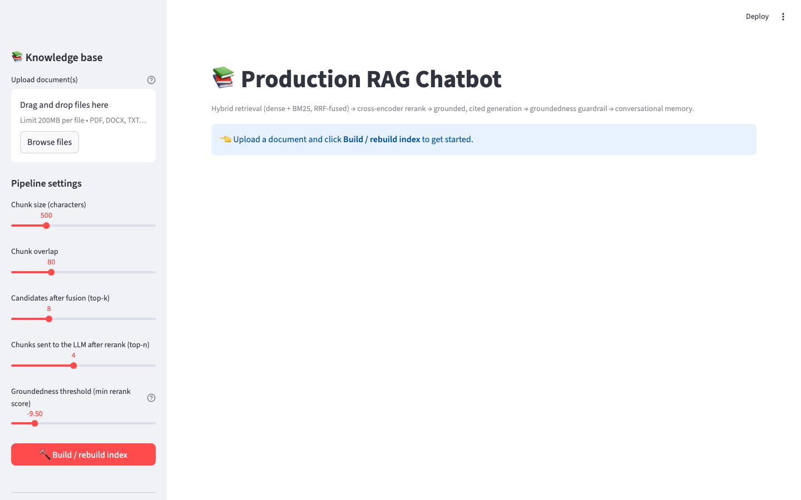
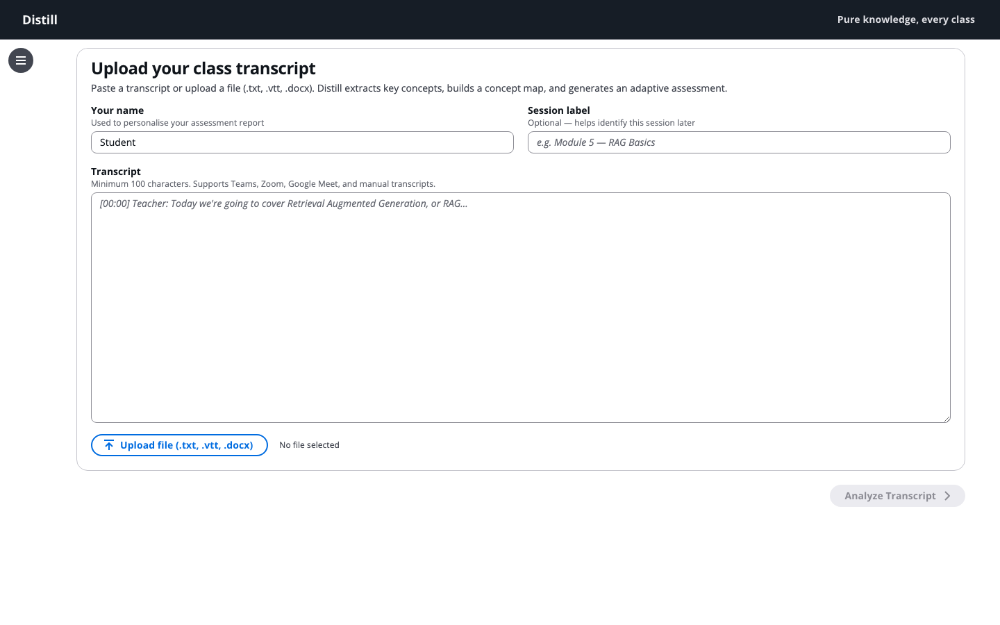
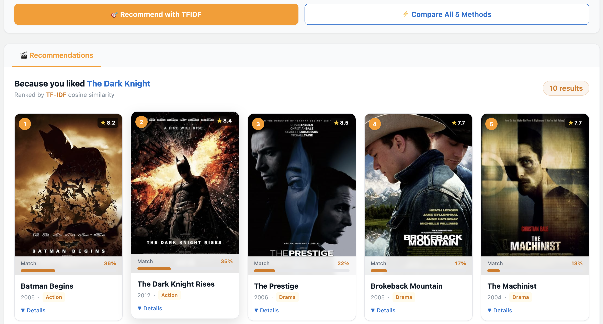
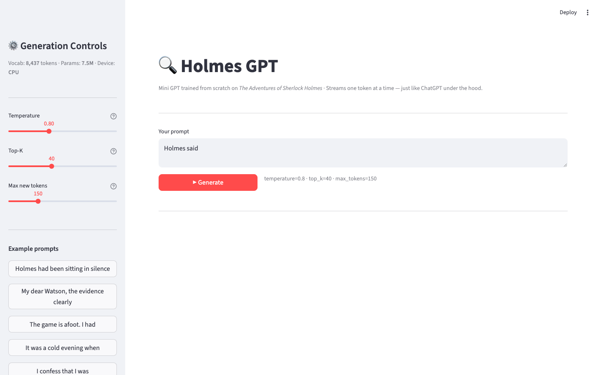

<div align="center">

# 🤖 Zero to GenAI Engineer

### From complete beginner → production AI engineer — one weekend at a time.

[](https://github.com/nursnaaz/zero-to-genai-engineer)
[](https://github.com/nursnaaz/zero-to-genai-engineer/fork)
[](https://www.python.org/)
[](https://www.langchain.com/)
[](https://www.langchain.com/langgraph)
[](./LICENSE)

[](https://linkedin.com/in/nursnaaz)
[](https://linkedin.com/in/nursnaaz)

**Real code · Real papers · Real datasets · Real apps · Built to get you hired**

[Start here](#-start-here) · [Syllabus](#-full-syllabus-every-session) · [Presentations](https://nursnaaz.github.io/zero-to-genai-engineer/) · [S10 RAG](#s10--rag--memory--chatbots-m07--m08--m06) · [S11 LangGraph](#s11--langgraph-stateful-agents-m10) · [S12 Deep Agents](#s12--langchain-vs-langgraph-vs-deep-agents) · [Projects](#-projects-you-can-ship)

</div>

---

| 14 sessions | 58 notebooks | 12 research papers | 20 HTML decks |
|:---:|:---:|:---:|:---:|
| Pre-work → S12 | Colab-ready, commented | GPT-1 → DPO + Attention | Open in any browser |
| **9 industry RAG briefs** | **10 in-repo apps** | **18 RAG notebooks** | **5 LangGraph notebooks** |
| Banking → insurance | Streamlit · FastAPI · React | Chunking → MCP helpdesk | Graphs · HITL · teams |

New sessions drop every **Saturday / Sunday**. Star the repo to get notified. Questions → **WhatsApp cohort group**.

---

## Table of contents

1. [Start here](#-start-here)
2. [Prerequisites](#-prerequisites)
3. [What's in this repo](#-whats-in-this-repo)
4. [The MISSING chain](#-the-missing-chain)
5. [Your instructor](#-your-instructor)
6. [How this repo is laid out](#-how-this-repo-is-laid-out)
7. [Sessions shipped so far](#-sessions-shipped-so-far)
8. [Full syllabus](#-full-syllabus-every-session)
9. [Projects](#-projects-you-can-ship)
10. [Classroom presentations](#-classroom-presentations)
11. [Tech stack](#-tech-stack-when-each-tool-first-appears)
12. [Module map](#-where-the-23-module-syllabus-stands)
13. [Contributing](#-contributing)
14. [License](#-license)

---

## 🚀 Start here

| You are… | Do this |
|---|---|
| **New to Python / ML** | [`prereq/`](./prereq/) (~3 hours) → then **[S00](./00_How_Search_Engine_Works/)** |
| **Ready for the course** | Open the next session folder. **The README inside is the start page.** Run notebooks in order. |
| **On RAG + memory (S10)** | [`10_RAG/README.md`](./10_RAG/). Notebooks **01–12** are required. **11, 13, and 14** are the chatbot / memory track. |
| **On LangGraph (S11)** | [`11_LangGraph/README.md`](./11_LangGraph/). Notebooks **01–03** required; **04–05** are bonus. |
| **On Deep Agents (S12)** | [`12_deepagents/README.md`](./12_deepagents/). One notebook: files, `AGENT.md`, `SKILL.md`, your tools, subagents. |
| **On the Dining Bot capstone (S13)** | [`13_Project_Implementation/README.md`](./13_Project_Implementation/). Spec + sample SQLite DB. |
| **Want the slides** | [Class presentations](https://nursnaaz.github.io/zero-to-genai-engineer/). Open those links. Clicking the `.html` in GitHub just shows source. |
| **Want a browser lab** | [nursnaaz.github.io](https://nursnaaz.github.io/). Direct URLs are listed under each session below. No API key. |
| **Caught up through S12** | Start [Dining Bot](./13_Project_Implementation/), or ship something from [Projects](#-projects-you-can-ship). |

Beginner notebooks (no install):

| Notebook | What you learn | Time |
|---|---|---|
| [01 — Python for GenAI](./prereq/notebooks/01_python_for_genai.ipynb) | Variables, loops, functions, dicts, f-strings | 60 min |
| [02 — Math Intuition](./prereq/notebooks/02_math_intuition.ipynb) | Vectors, dot product, softmax | 60 min |
| [03 — Neural Networks](./prereq/notebooks/03_neural_networks_intuition.ipynb) | How models learn, in plain English | 60 min |

Then keep the **[Cheat Sheet](./prereq/cheatsheet.md)** open during S00.

---

## ⚙️ Prerequisites

| Need | Detail |
|---|---|
| **Python** | **3.11+** (3.12 is fine). Launch session apps with `python3 -m streamlit` so you hit the same environment. |
| **Git** | Clone the repo. Don't copy folders around by hand. |
| **Notebooks** | [Google Colab](https://colab.research.google.com) if you want zero install, or local Jupyter. |
| **API keys** | S00–S03 (and most of S04 NB1) need none. S04 NB2 onwards uses Gemini. From S10, put `OPENAI_API_KEY` in a copy of [`10_RAG/.env.example`](./10_RAG/.env.example). Anthropic, Cohere, Pinecone, Tavily, LangSmith only when a notebook asks. |
| **Local models (S05 / S06 Ollama notebook)** | [Ollama](https://ollama.com) or [LM Studio](https://lmstudio.ai) on your laptop. These will not run in Colab. |
| **GPU** | Only the S02 training loop wants Colab Pro / a real GPU. Everything else is CPU or an API. |
| **Node 18+** | Only if you run a React app (CineMatch, Distill, RAG Studio, Medium article agent). Streamlit paths don't need it. |

```bash
git clone https://github.com/nursnaaz/zero-to-genai-engineer.git
cd zero-to-genai-engineer
```

Then open that weekend's folder README. That's the start page. There is no root `requirements.txt`; each session and app has its own (`10_RAG/notebooks/requirements.txt`, `11_LangGraph/notebooks/requirements.txt`, and so on).

Copy `.env.example` to `.env`. Don't commit the real one.

---

## 📦 What's in this repo

Every weekend is notebooks you actually run. Most also leave you with an app, a paper, or a dataset you can talk about in an interview.

| Kind of material | Count | Where it lives |
|---|---|---|
| Weekend sessions (S00–S12) + pre-work | **14** | Numbered folders + [`prereq/`](./prereq/) |
| Jupyter notebooks | **58** | Session `notebooks/`, 11 S03 paper summaries, 2 S10 student copies, plus the RAG Studio and agentic-RAG capstone notebooks. Ignore [`03_GPT_1_2_3/`](./03_GPT_1_2_3/) — leftover from an older layout. |
| RAG teaching notebooks (01–16 + 2 student labs) | **18** | [`10_RAG/notebooks/`](./10_RAG/notebooks/) |
| LangGraph teaching notebooks | **5** | [`11_LangGraph/notebooks/`](./11_LangGraph/notebooks/) (plus optional `self_correcting_rag.ipynb` in the capstone folder) |
| Original research PDFs | **12** | S02 *Attention Is All You Need* + S03 GPT / BERT / alignment |
| Beginner paper-summary notebooks | **11** | [`03_GPT_Evolution_and_Alignment/paper_summaries/`](./03_GPT_Evolution_and_Alignment/paper_summaries/) |
| Classroom HTML decks | **20** | S03 papers (1) · S08 recap (2) · S10 (12) · S11 (4) · S12 (1) |
| PDF slide decks | S00 (3) · S01 (1) · S02 (1) · S05 (`slides.pdf`) | Each session's `slides/` |
| Interactive browser tutorials | **25** | [nursnaaz.github.io](https://nursnaaz.github.io) — deep links next to each session |
| Student group RAG datasets | **9 companies** | [`10_RAG/student_group_datasets/`](./10_RAG/student_group_datasets/) |
| Shippable apps in this repo | **10** | See [Projects](#-projects-you-can-ship) |

Quick naming trap: folder `10_RAG/` is session **S10**, which covers modules **M07 + M08 + M06** (memory went into the RAG chatbot, not its own weekend). `11_LangGraph/` is session **S11** = module **M10**. `12_deepagents/` is **S12**. `13_Project_Implementation/` is **S13** (Dining Bot).

---

## 🔗 The MISSING chain

Every session exists because the last one left a gap. That chain is how the course is sequenced.

```text
S00  Search (TF-IDF)
  └─ MISSING: meaning  ─►  S01  Embeddings (BoW → FastText)
       └─ MISSING: context  ─►  S02  Transformers (self-attention)
            └─ MISSING: GPT story  ─►  S03  GPT-1→3 + alignment (11 papers)
                 └─ MISSING: tokens & sampling  ─►  S04  BPE / Temp / Top-K / Top-P
                      └─ MISSING: how to RUN a model  ─►  S05  Ollama · LM Studio · OpenRouter
                           └─ MISSING: better prompts  ─►  S06  DSPy · CoT · MIPROv2 · GEPA
                                └─ MISSING: one API for every model  ─►  S07  LangChain LCEL
                                     └─ S08 Recap (S00–S07 visual pass)
                                          └─ MISSING: AI that writes the code  ─►  S09  /goal · /loop
                                               └─ MISSING: YOUR documents  ─►  S10  RAG + memory + chatbots
                                                    └─ MISSING: loops, pause, teams  ─►  S11  LangGraph
                                                         └─ MISSING: files, skills, subagents  ─►  S12  Deep Agents
                                                              └─ MISSING: one product  ─►  S13  Dining Bot  ← you are here
```

---

## 👨‍🏫 Your instructor


**Mohamed Noordeen Alaudeen** — Data Scientist at **AWS Generative AI Innovation Center** · Dubai

- 🏆 Emerging Global Leader in GenAI — Internet 2.0 Conference Award (2024)
- 👥 29,000+ LinkedIn followers · 1,000+ professionals mentored
- 📚 Packt author (*Data Science Interview Questions*) · IIM Lucknow · 10+ years in AI/ML

> *"Learn GenAI the way professionals actually use it — not just theory, but systems that get you hired."*

---

## 📁 How this repo is laid out

One numbered folder per weekend. Open that folder's README first. Class slides are linked in the session table, next to the notebooks in the syllabus, and collected in [one list](#-classroom-presentations).

| Folder | Session | What's in it |
|---|---|---|
| [`prereq/`](./prereq/) | Pre-work | 3 notebooks + cheat sheet |
| [`00_How_Search_Engine_Works/`](./00_How_Search_Engine_Works/) | S00 | 2 notebooks |
| [`01_Text_to_Numbers/`](./01_Text_to_Numbers/) | S01 | 2 notebooks + [CineMatch](./01_Text_to_Numbers/movie_recommender/) |
| [`02_Transformer_Architecture/`](./02_Transformer_Architecture/) | S02 | Notebook, Vaswani paper, animation |
| [`03_GPT_Evolution_and_Alignment/`](./03_GPT_Evolution_and_Alignment/) | S03 | GPT from scratch + 11 papers |
| [`04_BPE_Temperature_Top_K_Top_P/`](./04_BPE_Temperature_Top_K_Top_P/) | S04 | 2 notebooks + 2 Excel workbooks |
| [`05_Local_LLMs_and_API_Providers/`](./05_Local_LLMs_and_API_Providers/) | S05 | 6 notebooks + [Distill](./05_Local_LLMs_and_API_Providers/distill/) |
| [`06_Prompt_Engineering_DSPY_GEPA_COT/`](./06_Prompt_Engineering_DSPY_GEPA_COT/) | S06 | DSPy → few-shot → MIPROv2 → GEPA |
| [`07_LangChain_Notebooks/`](./07_LangChain_Notebooks/) | S07 | One notebook: 4 providers, LCEL |
| [`08_Recap/`](./08_Recap/) | S08 | Recap of S00–S07 |
| [`09_AgenticCoding_LoopEngineering/`](./09_AgenticCoding_LoopEngineering/) | S09 | [`AGENTIC_CODING_GUIDE.md`](./09_AgenticCoding_LoopEngineering/AGENTIC_CODING_GUIDE.md) |
| [`10_RAG/`](./10_RAG/) | S10 | **[Start here](./10_RAG/README.md)** — 16 teaching notebooks, apps, 9 group briefs |
| [`11_LangGraph/`](./11_LangGraph/) | S11 | **[Start here](./11_LangGraph/README.md)** — 5 notebooks, helpdesk, agentic RAG |
| [`12_deepagents/`](./12_deepagents/) | S12 | **[Start here](./12_deepagents/README.md)** — LangChain vs LangGraph vs Deep Agents |
| [`13_Project_Implementation/`](./13_Project_Implementation/) | S13 | **[Start here](./13_Project_Implementation/README.md)** — Dining Bot spec + sample SQLite DB |

S11 extra (separate repo, not in this clone): [Medium article agent](https://github.com/nursnaaz/medium-article-agent).

---

## 🗺️ Sessions shipped so far

| Session | Topic | What you build | Slides |
|---|---|---|---|
| [Pre-work](./prereq/) | Python, vectors, how NNs learn | 3 Colab notebooks + cheat sheet | |
| [S00](./00_How_Search_Engine_Works/) | How Search Engines Work | TF-IDF engine from scratch | [Intro](https://nursnaaz.github.io/zero-to-genai-engineer/00_How_Search_Engine_Works/slides/00_genai_intro.pdf) · [Search](https://nursnaaz.github.io/zero-to-genai-engineer/00_How_Search_Engine_Works/slides/00_how_search_engine_works.pdf) · [Claude leak](https://nursnaaz.github.io/zero-to-genai-engineer/00_How_Search_Engine_Works/slides/00_claude_code_leak_summary.pdf) |
| [S01](./01_Text_to_Numbers/) | Text to Numbers | 5 embedding methods, CineMatch | [Text to Numbers](https://nursnaaz.github.io/zero-to-genai-engineer/01_Text_to_Numbers/slides/M00-S01.pdf) |
| [S02](./02_Transformer_Architecture/) | Transformer Architecture | Encoder–Decoder in PyTorch, EN→IT | [Transformers](https://nursnaaz.github.io/zero-to-genai-engineer/02_Transformer_Architecture/slides/Transformers.pptx.pdf) |
| [S03](./03_GPT_Evolution_and_Alignment/) | GPT Evolution & Alignment | GPT from scratch, 11 papers | [GPT papers](https://nursnaaz.github.io/zero-to-genai-engineer/03_GPT_Evolution_and_Alignment/GPT_Papers_Presentation.html) |
| [S04](./04_BPE_Temperature_Top_K_Top_P/) | BPE & Sampling | Tokenize from scratch, temperature / top-k / top-p | Excel workbooks in the folder |
| [S05](./05_Local_LLMs_and_API_Providers/) | Local LLMs & APIs | Ollama, LM Studio, OpenRouter, Distill | [Session PDF](https://nursnaaz.github.io/zero-to-genai-engineer/05_Local_LLMs_and_API_Providers/slides.pdf) |
| [S06](./06_Prompt_Engineering_DSPY_GEPA_COT/) | Prompt Optimisation | DSPy, CoT, MIPROv2, GEPA | |
| [S07](./07_LangChain_Notebooks/) | LangChain | One API for OpenAI, Claude, Gemini, Ollama | |
| [S08](./08_Recap/) | Recap | Visual pass of S00–S07 | [Interactive](https://nursnaaz.github.io/zero-to-genai-engineer/08_Recap/RECAP_PRESENTATION.html) · [Full text](https://nursnaaz.github.io/zero-to-genai-engineer/08_Recap/RECAP_SLIDES.html) |
| [S09](./09_AgenticCoding_LoopEngineering/) | Agentic Coding | `/goal` vs `/loop` | Guides in the folder |
| [S10](./10_RAG/) | RAG + Memory & Chatbots | Chunking → hybrid → RAGAS → chatbot with memory | [12 decks](https://nursnaaz.github.io/zero-to-genai-engineer/), also next to each notebook [below](#s10--rag--memory--chatbots-m07--m08--m06) |
| [S11](./11_LangGraph/) | LangGraph | Graphs, HITL, helpdesk, ReAct→ToT, SQL | [4 decks](https://nursnaaz.github.io/zero-to-genai-engineer/), also next to each day [below](#s11--langgraph-stateful-agents-m10) |
| [S12](./12_deepagents/) | Deep Agents | Chat vs files, `AGENT.md`, `SKILL.md` | [Food-delivery deck](https://nursnaaz.github.io/zero-to-genai-engineer/12_deepagents/notebooks/teaching_decks/teach_01_why_deep_agents.html) |
| [S13](./13_Project_Implementation/) | Dining Bot capstone | Spec + sample DB — RAG, read-only SQL, HITL, Weather + Chart MCP | |

---

## 📚 Full syllabus (every session)

Setup lives in each session README. If that weekend has slides, they are linked in the section (and again in the [presentation index](https://nursnaaz.github.io/zero-to-genai-engineer/)).

---

### Pre-work — Python, math, neural nets

> If S00 looks like a stretch, start here. About three hours of Python, vectors, and how a network learns.

| # | Notebook | Topics | Time |
|---|---|---|---|
| 01 | [Python for GenAI](./prereq/notebooks/01_python_for_genai.ipynb) | Variables, lists, loops, dicts, f-strings, functions | 60 min |
| 02 | [Math intuition](./prereq/notebooks/02_math_intuition.ipynb) | Vectors, dot product, probability, softmax | 60 min |
| 03 | [Neural nets](./prereq/notebooks/03_neural_networks_intuition.ipynb) | How a model learns, in plain English | 60 min |

Also: [`prereq/cheatsheet.md`](./prereq/cheatsheet.md) — keep it open during S00.

---

### S00 — How Search Engines Work

> **MISSING after this:** TF-IDF misses `"car crash"` when you search `"automobile accident"`. That is why S01 exists.

| # | Open | You build | Time |
|---|---|---|---|
| 01 | [search_engine.ipynb](./00_How_Search_Engine_Works/notebooks/01_search_engine.ipynb) | Tokenise · stop words · stem · inverted index · TF-IDF rank | 30 min |
| 02 | [tfidf_explained.ipynb](./00_How_Search_Engine_Works/notebooks/02_tfidf_explained.ipynb) | Why raw counts fail · TF × IDF scored by hand | 45 min |

**Slides:** [GenAI intro](https://nursnaaz.github.io/zero-to-genai-engineer/00_How_Search_Engine_Works/slides/00_genai_intro.pdf) · [How search works](https://nursnaaz.github.io/zero-to-genai-engineer/00_How_Search_Engine_Works/slides/00_how_search_engine_works.pdf) · [Claude Code leak](https://nursnaaz.github.io/zero-to-genai-engineer/00_How_Search_Engine_Works/slides/00_claude_code_leak_summary.pdf)

**Browser:** [How Search Engines Work](https://nursnaaz.github.io/tutorial/how-search-engines-work) (~45 min, no API key)  
**Write-up:** [How I Taught 100 Students to Build Google's Core Algorithm in 30 Minutes](https://medium.com/learning-data/how-i-taught-100-students-to-build-googles-core-algorithm-in-30-minutes-3166e6cc8636)

No API key. Pure Python.

---

### S01 — Text to Numbers

> **MISSING after this:** `"bank"` (river) and `"bank"` (finance) share one vector. S02 adds context.

| # | Open | You build | Time |
|---|---|---|---|
| 01 | [text_to_numbers.ipynb](./01_Text_to_Numbers/notebooks/01_text_to_numbers.ipynb) | BoW → TF-IDF → Word2Vec → GloVe → FastText | 60 min |
| 02 | [cosine_similarity.ipynb](./01_Text_to_Numbers/notebooks/02_cosine_similarity.ipynb) | Why cosine beats Euclidean for meaning | 30 min |

**App:** [CineMatch](./01_Text_to_Numbers/movie_recommender/) — FastAPI + React, 5 embedders on 1,000 IMDB movies.

**Assignments:** Medium article on the 5 methods · Medium article cosine vs Euclidean · product recommender (Amazon descriptions).

**Slides:** [Text to Numbers](https://nursnaaz.github.io/zero-to-genai-engineer/01_Text_to_Numbers/slides/M00-S01.pdf)  
**Browser:** [Cosine Similarity & Movie Recommender](https://nursnaaz.github.io/tutorial/cosine-similarity-movie-recommender)  
**Write-up:** [Words Don't Have Meaning. Sentences Do.](https://medium.com/generative-ai/words-dont-have-meaning-sentences-do-ef5b7745eac2)

---

### S02 — Transformer Architecture

> **MISSING after this:** Training from scratch is expensive. S03 is how that architecture became GPT and then ChatGPT.

| Open | You build |
|---|---|
| [transformer_from_scratch.ipynb](./02_Transformer_Architecture/notebooks/01_transformer_from_scratch.ipynb) | `InputEmbeddings` · sinusoidal PE · LayerNorm · residual · FFN · 8-head attention · 6-layer encoder + decoder · EN→IT on `opus_books` |

**Paper:** [`Attention_Is_All_You_Need.pdf`](./02_Transformer_Architecture/papers/Attention_Is_All_You_Need.pdf)  
**Slides:** [Transformer architecture](https://nursnaaz.github.io/zero-to-genai-engineer/02_Transformer_Architecture/slides/Transformers.pptx.pdf)

Do these in the browser before the notebook:

| Tutorial | Time | Write-up |
|---|---|---|
| [Self-Attention](https://nursnaaz.github.io/tutorial/self-attention) | 30 min | [Computed by hand](https://medium.com/generative-ai/i-ran-the-math-that-powers-chatgpt-heres-what-i-found-2fc45eecec59) |
| [Positional Encoding](https://nursnaaz.github.io/tutorial/positional-encoding) | 35 min | |
| [Multi-Head Attention](https://nursnaaz.github.io/tutorial/multi-head-attention) | 60 min | |
| [Transformer code](https://nursnaaz.github.io/tutorial/transformer-code) | 60 min | |

**Assets:** `SelfAttentionFull.mp4` · attention GIF · architecture spreadsheet.

GPU note: building blocks run on CPU; the training loop wants **Colab Pro / H100**.

---

### S03 — GPT Evolution & Alignment

> **M00 (foundations) ends here.** S00–S03 take you from raw text to how modern assistants are trained and aligned.

**Path:** text prediction (GPT-1) → scale (GPT-2/3) → alignment (RLHF → CAI → DPO).

| Track | What you open |
|---|---|
| Overview slides | [14-slide paper deck](https://nursnaaz.github.io/zero-to-genai-engineer/03_GPT_Evolution_and_Alignment/GPT_Papers_Presentation.html) |
| NB2 — map | [TensorFlow minimal GPT](./03_GPT_Evolution_and_Alignment/notebooks/NB2_GPT_TensorFlow_Minimal_Synthetic.ipynb) (~30 min) |
| NB1 — deep dive | [PyTorch Holmes GPT](./03_GPT_Evolution_and_Alignment/notebooks/NB1_GPT_PyTorch_Detailed_Holmes.ipynb) (~2–3 hr) — char / word / BPE, AdamW, attention heatmaps |
| App | [`holmes_gpt_ui.py`](./03_GPT_Evolution_and_Alignment/holmes_gpt_ui.py) — Streamlit generator |

**11 papers (PDF + beginner summary notebook each):**

| # | Paper | Year | The question it answers |
|---|---|---|---|
| 1 | GPT-1 | 2018 | Does pre-train + fine-tune beat training from scratch? |
| 2 | GPT-2 | 2019 | What if we scale and drop task-specific fine-tuning? |
| 3 | GPT-3 | 2020 | What happens at 175B — few-shot in the prompt? |
| 4 | BERT | 2018 | What if we read both directions? |
| 5 | BART | 2019 | What if we combine BERT + GPT? |
| 6 | InstructGPT / RLHF | 2022 | How does GPT-3 become ChatGPT? |
| 7 | HH-RLHF | 2022 | Helpful *and* harmless — the Claude research |
| 8 | Constitutional AI | 2022 | Can a written constitution replace human safety labels? |
| 9 | RLAIF | 2023 | Does AI feedback match human feedback at scale? |
| 10 | DPO | 2023 | Can we align without a reward model / PPO? |
| 11 | SELF-REFINE | 2023 | Can a model improve its own outputs? |

Summaries: [`paper_summaries/`](./03_GPT_Evolution_and_Alignment/paper_summaries/). PDFs: [`papers/`](./03_GPT_Evolution_and_Alignment/papers/).

**Browser:** [BERT for text classification](https://nursnaaz.github.io/tutorial/bert-classification) (after paper 4)

---

### S04 — BPE, Temperature, Top-K, Top-P

> **MISSING from S03:** How does the model turn words into IDs? How does it pick the *next* token?

| # | Open | You implement | Time |
|---|---|---|---|
| Excel | [`bpe_step_by_step.xlsx`](./04_BPE_Temperature_Top_K_Top_P/bpe_step_by_step.xlsx) | Watch merge rounds grow a vocab | 15 min |
| Excel | [`llm_temperature_topp_topk.xlsx`](./04_BPE_Temperature_Top_K_Top_P/llm_temperature_topp_topk.xlsx) | Sliders on a fixed distribution | 15 min |
| NB1 | [BPE Tokenization](./04_BPE_Temperature_Top_K_Top_P/notebooks/NB1_BPE_Tokenization.ipynb) | `build_bpe_vocab()` · `tokenize_with_bpe()` · tiktoken GPT-2 vs GPT-4 | 45 min |
| NB2 | [Temperature / Top-K / Top-P](./04_BPE_Temperature_Top_K_Top_P/notebooks/NB2_Temperature_TopK_TopP.ipynb) | `apply_temperature()` · filters · Gemini experiments · `sample_token()` in the correct order | 45 min |

**Browser (do these before the Excel / notebooks):** [Tokens / BPE](https://nursnaaz.github.io/tutorial/tokens-are-money) · [Temperature, top-k, top-p](https://nursnaaz.github.io/tutorial/sampling-temperature-topk-topp) · [Context window budget](https://nursnaaz.github.io/tutorial/context-window-budget)  
**Write-up (BPE):** [One Word. Two Tokens. Here Is How BPE Builds Them.](https://medium.com/@nursnaaz/one-word-two-tokens-here-is-how-bpe-builds-them-031f23614e65)

**Order that matters:** temperature → top-K → top-P → sample. Getting this wrong is a common production bug.

---

### S05 — Local LLMs & API Providers

> **MISSING from S04:** One provider's API is a lock-in. Run a model on your laptop, or switch cloud providers by changing one variable.

| # | Notebook | Where it runs | Time |
|---|---|---|---|
| NB1 | [Multi-provider `chat()`](./05_Local_LLMs_and_API_Providers/notebooks/NB1_multi_provider_api_calls.ipynb) | Colab or local — OpenAI · Gemini · Anthropic · Ollama · OpenRouter · Databricks | 30 min |
| NB2 | [Map-reduce summariser](./05_Local_LLMs_and_API_Providers/notebooks/NB2_map_reduce_summarizer.ipynb) | Split a 50-page doc → map → reduce | 45 min |
| NB3 | [Ollama](./05_Local_LLMs_and_API_Providers/notebooks/NB3_Ollama_Local_Setup.ipynb) | **Laptop only** — Phi-3 / Llama 3.2 | 45 min |
| NB4 | [OpenRouter](./05_Local_LLMs_and_API_Providers/notebooks/NB4_OpenRouter_Multi_Provider.ipynb) | One key, 100+ models, cost compare | 20 min |
| NB5 | [LM Studio](./05_Local_LLMs_and_API_Providers/notebooks/NB5_LMStudio_Local_Setup.ipynb) | **Laptop only** — OpenAI-compatible `:1234` | 30 min |
| NB6 | [Databricks serving](./05_Local_LLMs_and_API_Providers/notebooks/NB6_Databricks_Endpoint.ipynb) | Enterprise REST pattern | 15 min |

**Demos:** [`apps/multi_provider_race.py`](./05_Local_LLMs_and_API_Providers/apps/multi_provider_race.py) · [`apps/map_reduce_demo.py`](./05_Local_LLMs_and_API_Providers/apps/map_reduce_demo.py)

**Portfolio:** [Distill](./05_Local_LLMs_and_API_Providers/distill/) — FastAPI + React + Whisper classroom tool ([contribute](https://github.com/nursnaaz/distill/blob/main/CONTRIBUTING.md)).

**Browser:** [Your first LLM call](https://nursnaaz.github.io/tutorial/first-llm-call) · [Local vs cloud](https://nursnaaz.github.io/tutorial/local-vs-cloud)

**Slides:** [S05 session PDF](https://nursnaaz.github.io/zero-to-genai-engineer/05_Local_LLMs_and_API_Providers/slides.pdf)

---

### S06 — Prompt Optimisation (DSPy · MIPROv2 · GEPA)

> **MISSING from S05:** We could call models. Prompts were still handwritten guesses. Treat them as **typed, versioned, scored code**.

| Day | Optimiser | What it changes | Artifact |
|---|---|---|---|
| **S06a** | `dspy.Signature` + `ChainOfThought` | Schema → prompt; visible `Reasoning:` | `cot_zero_shot.json` |
| **S06b** | LabeledFewShot | Random `k` demos | `cot_few_shot.json` |
| S06b | BootstrapFewShot | Keep only traces that pass the metric | `cot_boostraped_few_shot.json` |
| S06b | BootstrapFewShotWithRandomSearch | Best of N bootstrap runs | `cot_bootstraped_rs_few_shot.json` |
| **S06c** | **MIPROv2** | Searches the *instruction wording* + demos | `MiproV2Prompt.json` |
| **S06d** | **GEPA** | Rewrites the instruction from its own errors | generated in-notebook |

Benchmark used throughout: **ATIS** airline-intent (26 classes).

| File | Use when |
|---|---|
| [`dspy_training.ipynb`](./06_Prompt_Engineering_DSPY_GEPA_COT/dspy_training.ipynb) | Cloud — all four optimisers |
| [`dspy_training_ollama.ipynb`](./06_Prompt_Engineering_DSPY_GEPA_COT/dspy_training_ollama.ipynb) | Local, no API key |

**Browser (before DSPy):** [Zero-shot / few-shot / CoT](https://nursnaaz.github.io/tutorial/prompt-anatomy) · [JSON or bust](https://nursnaaz.github.io/tutorial/json-or-bust)

---

### S07 — LangChain Fundamentals

> **MISSING from S06:** Each notebook talked to one provider with custom glue. LangChain is one interface.

| Notebook | Topics | Time |
|---|---|---|
| [langchain_claude_openai_gemini_ollama_stream.ipynb](./07_LangChain_Notebooks/langchain_claude_openai_gemini_ollama_stream.ipynb) | Unified chat · `ChatPromptTemplate` · `MessagesPlaceholder` · `InMemoryChatMessageHistory` · `.stream()` · LCEL `\|` pipes | 60 min |

Providers in the same notebook: `gpt-4o-mini` · Claude Haiku · Gemini Flash-Lite · Ollama `llama3.2` / `qwen2.5`.

**Browser:** [Chatbots forget](https://nursnaaz.github.io/tutorial/chatbots-forget) (why you must send the message list) · [First LLM call](https://nursnaaz.github.io/tutorial/first-llm-call)

---

### S08 — Recap (S00–S07)

Visual pass of the MISSING chain before agentic coding.

- [Interactive presentation](https://nursnaaz.github.io/zero-to-genai-engineer/08_Recap/RECAP_PRESENTATION.html)
- [Full-text slides](https://nursnaaz.github.io/zero-to-genai-engineer/08_Recap/RECAP_SLIDES.html)

---

### S09 — Agentic Coding & Loop Engineering

> **MISSING from S07:** You still typed every line. Spec the goal, verify with tests, loop until green.

| Day | Topic | You learn |
|---|---|---|
| **S09a** | Agentic coding | Prompting → ReAct → AutoGPT → RALPH → loop · what makes a good `/goal` · Kiro spec files |
| **S09b** | Loop engineering | `/goal` vs `/loop` · Trigger → Action → Verify → Decide → Stop · Claude Code hooks |

| File | What it is |
|---|---|
| [`AGENTIC_CODING_GUIDE.md`](./09_AgenticCoding_LoopEngineering/AGENTIC_CODING_GUIDE.md) | History, patterns, tooling |
| [`LOOP_ENGINEERING_PLAYBOOK.md`](./09_AgenticCoding_LoopEngineering/loop_demo/LOOP_ENGINEERING_PLAYBOOK.md) | **20+ exercises** |
| [`LoopEngineering.md`](./09_AgenticCoding_LoopEngineering/loop_demo/LoopEngineering.md) | Theory |

**Browser:** [ReAct with a calculator](https://nursnaaz.github.io/tutorial/one-tool-one-loop) — thought → tool → observation → stop.

**Demo (external):** [Bullish Stock Scanner V3](https://github.com/nursnaaz/TechnicalStockPrediction/tree/feature/v3-high-precision). FastAPI + React, 308 tests, built through spec-driven loops.

---

### S10 — RAG + Memory & Chatbots (M07 + M08 + M06)

> **MISSING from S09:** Agents can write software. They still only know training data. RAG grounds answers in *your* PDFs, policies, and tickets.
>
> Memory & chatbots (M06) live here too: short-term memory, summarisation, long-term `Store`, condense-question, streaming, guardrails, and HITL are in **S10f + notebooks 13–14**.

**Start page:** [`10_RAG/README.md`](./10_RAG/) · notebook index: [`10_RAG/notebooks/README.md`](./10_RAG/notebooks/)

**Browser:** [Tiny RAG](https://nursnaaz.github.io/tutorial/tiny-rag) · [Chunking](https://nursnaaz.github.io/tutorial/chunking-intuition) · [Hybrid + RRF](https://nursnaaz.github.io/tutorial/hybrid-search-rrf) · [Citations / refusals](https://nursnaaz.github.io/tutorial/citations-and-refusals) · [RAG injection](https://nursnaaz.github.io/tutorial/rag-injection-guardrails) · [Chat memory](https://nursnaaz.github.io/tutorial/chatbots-forget) · [Production challenges](https://nursnaaz.github.io/tutorial/production-challenges)  
**Write-up (Tiny RAG):** [I Asked ChatGPT About Our Gym's Refund Policy. It Invented One.](https://medium.com/@nursnaaz/i-asked-chatgpt-about-our-gyms-refund-policy-it-invented-one-bbf28cdf7ecc)

```text
S10a  Why RAG
S10b  Chunking (LangChain) + same ideas in LlamaIndex
S10c  Embeddings → FAISS / Chroma / Pinecone
S10d  BM25 → hybrid (RRF) → reranking
S10e  RAGAS + DeepEval
S10f  Production chatbots = Memory & Chatbots track
S10g  Retrieval showdown on one Pinecone index
        │
        ├── 13–14  Production chatbot (+ durable memory)   capstone
        ├── 15      Multimodal RAG                          extra
        ├── 16      MCP helpdesk                            extra · required for S11c
        ├── RAG Studio                                      FastAPI + React portfolio
        └── 9 student group datasets                        real-company briefs
```

#### Core notebooks (required)

| Day | Notebook | Topic | Slides |
|---|---|---|---|
| **S10a** | [01 — Why RAG](./10_RAG/notebooks/01_why_rag_the_case_for_retrieval.ipynb) | Hallucination vs grounded retrieval | [▶](https://nursnaaz.github.io/zero-to-genai-engineer/10_RAG/notebooks/teaching_decks/teach_01_why_rag.html) |
| **S10b** | [02 — Chunking (LangChain)](./10_RAG/notebooks/02_ingestion_and_chunking_langchain.ipynb) | 6 chunking strategies | [▶](https://nursnaaz.github.io/zero-to-genai-engineer/10_RAG/notebooks/teaching_decks/teach_02_ingestion_chunking.html) |
| S10b | [03 — Chunking (LlamaIndex)](./10_RAG/notebooks/03_ingestion_and_chunking_llamaindex.ipynb) | Same ideas, second framework | [▶](https://nursnaaz.github.io/zero-to-genai-engineer/10_RAG/notebooks/teaching_decks/teach_03_ingestion_chunking_llamaindex.html) |
| **S10c** | [04 — Embeddings](./10_RAG/notebooks/04_embeddings.ipynb) | Geometry of meaning | [▶](https://nursnaaz.github.io/zero-to-genai-engineer/10_RAG/notebooks/teaching_decks/teach_04_embeddings.html) |
| S10c | [05 — Vector databases](./10_RAG/notebooks/05_vector_databases.ipynb) | FAISS → Chroma → Pinecone | [▶](https://nursnaaz.github.io/zero-to-genai-engineer/10_RAG/notebooks/teaching_decks/teach_05_vector_databases.html) |
| | Recap of 01–05 | | [▶ Revision](https://nursnaaz.github.io/zero-to-genai-engineer/10_RAG/notebooks/teaching_decks/revision_notebooks_01_to_05.html) |
| **S10d** | [06 — Sparse retrieval](./10_RAG/notebooks/06_sparse_retrieval.ipynb) | BM25 vs dense vs SPLADE | [▶](https://nursnaaz.github.io/zero-to-genai-engineer/10_RAG/notebooks/teaching_decks/teach_06_why_bm25.html) |
| S10d | [07 — Hybrid search](./10_RAG/notebooks/07_hybrid_search.ipynb) | RRF / weighted fusion | [▶](https://nursnaaz.github.io/zero-to-genai-engineer/10_RAG/notebooks/teaching_decks/teach_07_why_hybrid.html) |
| S10d | [08 — Reranking](./10_RAG/notebooks/08_reranking.ipynb) | Cross-encoder / FlashRank / Cohere | [▶](https://nursnaaz.github.io/zero-to-genai-engineer/10_RAG/notebooks/teaching_decks/teach_08_why_reranking.html) |
| | Pipeline recap | | [▶](https://nursnaaz.github.io/zero-to-genai-engineer/10_RAG/notebooks/teaching_decks/teach_09_full_pipeline_recap.html) |
| **S10e** | [09 — RAGAS](./10_RAG/notebooks/09_ragas_evaluation.ipynb) | Faithfulness, relevancy, context precision / recall | |
| S10e | [10 — DeepEval](./10_RAG/notebooks/10_deepeval_evaluation.ipynb) | CI-native evals, hallucination, G-Eval | |
| **S10f** | [11 — Production chatbots](./10_RAG/notebooks/11_production_ready_chatbots.ipynb) | **Memory · streaming · guardrails · HITL** | [▶](https://nursnaaz.github.io/zero-to-genai-engineer/10_RAG/notebooks/teaching_decks/teach_11_production_chatbots.html) |
| **S10g** | [12 — Retrieval showdown](./10_RAG/notebooks/12_retrieval_showdown_pinecone.ipynb) | Dense vs BM25 vs hybrid on **one** Pinecone index | |

#### Memory & Chatbots — what S10f / 13 / 14 actually teach (M06)

The chatbot module sits next to retrieval on purpose. A production bot is RAG plus memory.

| Topic | Where | What you can do after |
|---|---|---|
| Stateless vs `thread_id` | NB11 §2–3 | Same id remembers; new id is a new user |
| Short-term memory (checkpointer) | NB11 | `InMemorySaver` / SQLite — crash-safe turns |
| Token-budget trim (sliding window) | NB11 §5b | Drop oldest turns before the context explodes |
| Summarisation memory | NB11 | Auto-summarise when history crosses a token trigger |
| Long-term `Store` | NB11 §6 | Preferences that survive across threads |
| Condense-question | NB13 | Rewrite follow-ups ("what about *that* policy?") into a standalone query |
| Streaming tokens | NB11 | Token-by-token UI, not a spinner |
| Guardrails | NB11 | Refuse / block before a bad generation |
| Human-in-the-loop | NB11 §9 | Pause a risky tool until a human says yes |
| Observability | NB11 §12 | LangSmith traces |
| Production Streamlit bot | [NB13](./10_RAG/notebooks/13_capstone_production_rag_chatbot.ipynb) → [`production_rag_chatbot/`](./10_RAG/notebooks/production_rag_chatbot/) | Hybrid retrieve → rerank → generate + citations |
| Same bot + durable memory | [NB14](./10_RAG/notebooks/14_capstone_production_rag_chatbot_memory.ipynb) → [`production_rag_chatbot_memory/`](./10_RAG/notebooks/production_rag_chatbot_memory/) | Memory that lasts after you close the tab |
| Student labs | [13 STUDENT](./10_RAG/notebooks/13_capstone_production_rag_chatbot_STUDENT.ipynb) · [14 STUDENT](./10_RAG/notebooks/14_capstone_production_rag_chatbot_memory_STUDENT.ipynb) | Same pipeline, TODOs for you |

S11 reuses `condense()`, `trim_history()`, the checkpointer, and `Store`. We don't teach them again.

#### Capstones & extras

| Item | What it is |
|---|---|
| [15 — Multimodal RAG](./10_RAG/notebooks/15_multimodal_rag_images.ipynb) ([slides](https://nursnaaz.github.io/zero-to-genai-engineer/10_RAG/notebooks/teaching_decks/teach_15_multimodal_rag.html)) | Images + text in one index |
| [16 — MCP helpdesk](./10_RAG/notebooks/16_capstone_mcp_agents_rag.ipynb) | RAG + SQL tools over MCP. Required before S11 Day 3. |
| **[RAG Studio](./10_RAG/capstone_rag_studio/)** ([eval slides](https://nursnaaz.github.io/zero-to-genai-engineer/10_RAG/capstone_rag_studio/reports/rag_strategy_evaluation_presentation.html)) | FastAPI + React. Swap retrieval strategies side by side, RAGAS + DeepEval. |
| **[9 group datasets](./10_RAG/student_group_datasets/)** | Real-company briefs (below) |

#### 9 student group datasets (cohort project)

Every group ships a cited, refusal-aware support bot and **8 ablation tables** (parse → chunk → embed → store → retrieve → fuse → rerank → generate). Spec: [`REQUIREMENTS_OVERVIEW.md`](./10_RAG/student_group_datasets/REQUIREMENTS_OVERVIEW.md) · metrics: [`EVALUATION_METHODOLOGY.md`](./10_RAG/student_group_datasets/EVALUATION_METHODOLOGY.md).

| # | Folder | Bot | Core skill | Data |
|---|---|---|---|---|
| 1 | [`01_banking`](./10_RAG/student_group_datasets/01_banking/) | Wells Fargo support | Grounded fee/policy Q&A | 3 PDF (60p) + XML |
| 2 | [`02_ecommerce`](./10_RAG/student_group_datasets/02_ecommerce/) | Amazon seller support | Seller-vs-buyer scope | 3 PDF (56p) + XML |
| 3 | [`03_telecom`](./10_RAG/student_group_datasets/03_telecom/) | Verizon support | Wireless / Fios / international routing | 3 PDF (40p) + XML |
| 4 | [`04_legal`](./10_RAG/student_group_datasets/04_legal/) | Law-firm contract search | Cross-doc retrieval + client attribution | 5 HTML (~105K words) |
| 5 | [`05_healthcare`](./10_RAG/student_group_datasets/05_healthcare/) | NIH-style health info | **Must refuse diagnosis** | 11k+ XML (download script) |
| 6 | [`06_finance_complaints`](./10_RAG/student_group_datasets/06_finance_complaints/) | Credit-rights helpline | ECOA vs Fair Housing routing | 4 PDF + CSV |
| 7 | [`07_airline_travel`](./10_RAG/student_group_datasets/07_airline_travel/) | Delta passenger support | Passenger-vs-cargo docs | 2 PDF (45p) + XML |
| 8 | [`08_tax_government`](./10_RAG/student_group_datasets/08_tax_government/) | IRS taxpayer help | Structured vs narrative retrieval | 3 PDF (244p) + CSV/XLS |
| 9 | [`09_insurance`](./10_RAG/student_group_datasets/09_insurance/) | State Farm support | State + product-line routing | 5 PDF (343p) + XLSX |

---

### S11 — LangGraph (stateful agents, M10)

> **MISSING from S10:** `ProductionRAGChatbot.chat()` is a **straight line**. It cannot retry retrieval, rewrite a vague question, or pause for a human. LangGraph is that control flow.

**Start page:** [`11_LangGraph/README.md`](./11_LangGraph/) · notebooks: [`notebooks/README.md`](./11_LangGraph/notebooks/)

**Browser:** [ReAct](https://nursnaaz.github.io/tutorial/one-tool-one-loop) · [HITL](https://nursnaaz.github.io/tutorial/human-in-the-loop) · [MCP](https://nursnaaz.github.io/tutorial/mcp-as-usb)

```text
S11a  Fundamentals & agents     required
S11b  Human-in-the-loop         required
S11c  Multi-agent orchestrator  required
  ├── S11d  Reasoning patterns  bonus (interview map)
  ├── S11e  SQL agent           bonus (Chinook)
  ├── capstone_agentic_rag/     optional self-correcting RAG
  └── medium-article-agent      optional FastAPI + React (separate repo)
```

Clone [nursnaaz/medium-article-agent](https://github.com/nursnaaz/medium-article-agent) (Python **3.12+**, Node 18+). Not bundled in this repo.

| Day | Open | What you do | Time | Slides |
|---|---|---|---|---|
| **S11a** | [01 — Fundamentals](./11_LangGraph/notebooks/01_langgraph_fundamentals_and_agents.ipynb) | Draw a graph, wire nodes/edges, build ReAct by hand, then `create_agent`, checkpointer, stream | ~2 hr | [fundamentals](https://nursnaaz.github.io/zero-to-genai-engineer/11_LangGraph/notebooks/teaching_decks/teach_01_langgraph_fundamentals.html) |
| **S11b** | [02 — HITL](./11_LangGraph/notebooks/02_human_in_the_loop.ipynb) | `interrupt()` a risky tool, type yes/no, resume the same `thread_id` | ~1 hr | [HITL](https://nursnaaz.github.io/zero-to-genai-engineer/11_LangGraph/notebooks/teaching_decks/teach_02_human_in_the_loop.html) |
| **S11c** | [03 — Orchestrator](./11_LangGraph/notebooks/03_multi_agent_orchestrator.ipynb) + [app](./11_LangGraph/multi_agent_orchestrator/) | Supervisor, RAG-as-tool, SQL over MCP, ticket writes pause | ~2 hr | live from the app |
| **S11d** | [04 — Patterns](./11_LangGraph/notebooks/04_agent_reasoning_patterns_masterclass.ipynb) | Name ReAct, Reflection, Reflexion, REWOO, Tree-of-Thoughts, Self-Discover, and when to use each | ~2 hr | [patterns](https://nursnaaz.github.io/zero-to-genai-engineer/11_LangGraph/notebooks/teaching_decks/teach_04_agent_reasoning_patterns.html) |
| **S11e** | [05 — SQL agent](./11_LangGraph/notebooks/05_sql_agent_langgraph.ipynb) | Force list-tables → schema → check → run on Chinook | ~1.5 hr | [SQL](https://nursnaaz.github.io/zero-to-genai-engineer/11_LangGraph/notebooks/teaching_decks/teach_05_sql_agent.html) |

**API you actually type:** `StateGraph` · `MessagesState` · `ToolNode` · `tools_condition` · `Command` · `interrupt()` · `MemorySaver` · `InMemoryStore` · `create_agent` · `create_supervisor`.

**Day 3 graph (the one you run):**

```text
top_supervisor
  ├── knowledge_team → rag_agent (search_knowledge_base) + search_agent (web)
  └── ops_team       → sql_agent (reads) + ticket_agent (writes → interrupt())
```

```bash
cd 11_LangGraph/multi_agent_orchestrator
python3 -m streamlit run app.py
```

Try: *“What is our refund policy?”* · *“How many open tickets does Jane Doe have?”* · *“Add a note that we offered a refund”* (then type **yes** or **no**).

---

### S12 — LangChain vs LangGraph vs Deep Agents

> **MISSING from S11:** LangChain talks. LangGraph is steps you wrote. Deep Agents is that graph with file tools, `AGENT.md`, `SKILL.md`, your tools, and helpers already attached — so “also add eggs” is not a new Python node.

**Start page:** [`12_deepagents/README.md`](./12_deepagents/) · [notebook](./12_deepagents/notebooks/01_langchain_langgraph_deepagents.ipynb) · [slides](https://nursnaaz.github.io/zero-to-genai-engineer/12_deepagents/notebooks/teaching_decks/teach_01_why_deep_agents.html)

| # | What you run | Proof |
|---|---|---|
| LangChain cell | Shopping list in chat | No `files` |
| LangGraph cell | `write_list` → stop | No `add_eggs` node |
| Ex 1 | `shopping.md` then add eggs | File tools |
| Ex 2 | `AGENT.md` | “Gulf Mart” not in the user prompt |
| Ex 3 | `SKILL.md` | `INV-001` from the how-to |
| Ex 4 | `get_store_hours` → `hours.md` | Your tool + `write_file` |
| Ex 5 | `price-lister` helper | Empty-chat subagent |

**API:** `create_deep_agent` · `memory=` · `skills=` · `tools=` · `subagents=` · `write_file` (built in).

---

### S13 — Dining Bot (capstone)

> **MISSING from S12:** a product. Dining Bot is one restaurant-manager chat: RAG over policies, read-only SQL over orders, two MCP servers (weather + charts), and **add menu item** only after HITL. The LLM proposes; code validates and executes.

**Start page:** [`13_Project_Implementation/README.md`](./13_Project_Implementation/) · [requirement (docx)](./13_Project_Implementation/Dining_Bot_Requirement_v1.1.docx) · [sample DB notes](./13_Project_Implementation/README_DATABASE.md)

```bash
cd 13_Project_Implementation
python3 build_db.py
```

---

## 🏗️ Projects you can ship

| Project | Session | Stack | What it is |
|---|---|---|---|
| **[Dining Bot](./13_Project_Implementation/)** | S13 | LangGraph, RAG, SQLite, MCP, HITL | Capstone spec + sample DB. You implement the assistant. |
| **[Self-Correcting Agentic RAG](./11_LangGraph/capstone_agentic_rag/)** | S11 extra | LangGraph, RAGAS, Streamlit | Grade → rewrite → groundedness loop → escalate |
| **[Medium Article Agent](https://github.com/nursnaaz/medium-article-agent)** | S11 extra | LangGraph, FastAPI, React | Ingest PDF/PPTX/HTML → draft → 6 reviewers → HITL → Markdown. Separate repo — not in this clone. |
| **[RAG Studio](./10_RAG/capstone_rag_studio/)** | S10 | FastAPI, React, RAGAS, DeepEval | Swap retrieval strategies and compare scores. [Eval slides](https://nursnaaz.github.io/zero-to-genai-engineer/10_RAG/capstone_rag_studio/reports/rag_strategy_evaluation_presentation.html) |
| **[Production RAG chatbot](./10_RAG/notebooks/production_rag_chatbot/)** | S10 | Streamlit, hybrid + rerank | Cited answers over a knowledge base |
| **[RAG chatbot + memory](./10_RAG/notebooks/production_rag_chatbot_memory/)** | S10 / M06 | Streamlit, checkpointer / Store | Multi-turn support bot that remembers |
| **[MCP helpdesk server](./10_RAG/notebooks/production_mcp_agents_rag_capstone/)** | S10 extra | MCP, SQL, RAG | Tools the S11 orchestrator actually calls |
| **[Distill](./05_Local_LLMs_and_API_Providers/distill/)** | S05 | FastAPI, React, Whisper | Classroom assessment. [Contribute](https://github.com/nursnaaz/distill/blob/main/CONTRIBUTING.md) |
| **[Provider race + map-reduce](./05_Local_LLMs_and_API_Providers/apps/)** | S05 | Streamlit | Same prompt to OpenAI, Gemini, Anthropic, Ollama and OpenRouter side by side, plus a long-document summariser |
| **[CineMatch](./01_Text_to_Numbers/movie_recommender/)** | S01 | FastAPI, React | 5 embedders, same 1,000 movies |
| **[Holmes GPT](./03_GPT_Evolution_and_Alignment/holmes_gpt_ui.py)** | S03 | PyTorch, Streamlit | A GPT you trained yourself |
| **[Bullish Stock Scanner V3](https://github.com/nursnaaz/TechnicalStockPrediction/tree/feature/v3-high-precision)** | S09 | FastAPI, React, 308 tests | Spec-driven loop engineering, outside this repo |

### What they look like

Live captures of the apps in this repo (same style as the [Medium article agent](https://github.com/nursnaaz/medium-article-agent) README). Click a screenshot to open that project.

<p align="center">
  <a href="./11_LangGraph/multi_agent_orchestrator/"></a>
</p>
<p align="center"><em><a href="./11_LangGraph/multi_agent_orchestrator/">Helpdesk Orchestrator</a> — supervisor routes RAG, web, SQL, and ticket writes that pause for you.</em></p>

<p align="center">
  <a href="./11_LangGraph/capstone_agentic_rag/"></a>
</p>
<p align="center"><em><a href="./11_LangGraph/capstone_agentic_rag/">Self-Correcting Agentic RAG</a> — grade, rewrite, RAGAS, escalate.</em></p>

<p align="center">
  <a href="https://github.com/nursnaaz/medium-article-agent"></a>
</p>
<p align="center"><em><a href="https://github.com/nursnaaz/medium-article-agent">Medium Article Agent</a> — 23-node editorial graph (separate repo).</em></p>

<p align="center">
  <a href="./10_RAG/capstone_rag_studio/"></a>
</p>
<p align="center"><em><a href="./10_RAG/capstone_rag_studio/">RAG Studio</a> — ingest, swap strategies, chat, evaluate.</em></p>

<p align="center">
  <a href="./10_RAG/notebooks/production_rag_chatbot/"></a>
</p>
<p align="center"><em><a href="./10_RAG/notebooks/production_rag_chatbot/">Production RAG chatbot</a> — hybrid retrieval + rerank + cited answers.</em></p>

<p align="center">
  <a href="./10_RAG/notebooks/production_rag_chatbot_memory/"></a>
</p>
<p align="center"><em><a href="./10_RAG/notebooks/production_rag_chatbot_memory/">RAG chatbot + memory</a> — same engine, durable conversation memory.</em></p>

<p align="center">
  <a href="./05_Local_LLMs_and_API_Providers/distill/"></a>
</p>
<p align="center"><em><a href="./05_Local_LLMs_and_API_Providers/distill/">Distill</a> — transcript in, concept map + adaptive quiz out.</em></p>

<p align="center">
  <a href="./01_Text_to_Numbers/movie_recommender/"></a>
</p>
<p align="center"><em><a href="./01_Text_to_Numbers/movie_recommender/">CineMatch</a> — five embedders on the same 1,000 movies.</em></p>

<p align="center">
  <a href="./03_GPT_Evolution_and_Alignment/holmes_gpt_ui.py"></a>
</p>
<p align="center"><em><a href="./03_GPT_Evolution_and_Alignment/holmes_gpt_ui.py">Holmes GPT</a> — a GPT you trained yourself, streaming one token at a time.</em></p>

---

## 🎮 Classroom presentations

GitHub's file view shows HTML source, not slides. Use the links below, or the [full index](https://nursnaaz.github.io/zero-to-genai-engineer/).

S00–S11 browser labs (no API key) live on [nursnaaz.github.io](https://nursnaaz.github.io). Same pairing as that site’s README. Medium write-ups are listed only when the article is live.

| Session | Lab | Medium |
|---|---|---|
| S00 | [How search engines work](https://nursnaaz.github.io/tutorial/how-search-engines-work) | [TF-IDF / 100 students](https://medium.com/learning-data/how-i-taught-100-students-to-build-googles-core-algorithm-in-30-minutes-3166e6cc8636) |
| S01 | [Cosine similarity & movie recommender](https://nursnaaz.github.io/tutorial/cosine-similarity-movie-recommender) | [Words don't have meaning](https://medium.com/generative-ai/words-dont-have-meaning-sentences-do-ef5b7745eac2) |
| S02 | [Self-attention](https://nursnaaz.github.io/tutorial/self-attention) | [Computed by hand](https://medium.com/generative-ai/i-ran-the-math-that-powers-chatgpt-heres-what-i-found-2fc45eecec59) |
| S02 | [Positional encoding](https://nursnaaz.github.io/tutorial/positional-encoding) | |
| S02 | [Multi-head attention](https://nursnaaz.github.io/tutorial/multi-head-attention) | |
| S02 | [Transformer code](https://nursnaaz.github.io/tutorial/transformer-code) | |
| S03 | [BERT classification](https://nursnaaz.github.io/tutorial/bert-classification) | |
| S04 | [Tokens / BPE](https://nursnaaz.github.io/tutorial/tokens-are-money) | [One word, two tokens](https://medium.com/@nursnaaz/one-word-two-tokens-here-is-how-bpe-builds-them-031f23614e65) |
| S04 | [Sampling](https://nursnaaz.github.io/tutorial/sampling-temperature-topk-topp) | |
| S04 | [Context window](https://nursnaaz.github.io/tutorial/context-window-budget) | |
| S05 | [First LLM call](https://nursnaaz.github.io/tutorial/first-llm-call) | |
| S05 | [Local vs cloud](https://nursnaaz.github.io/tutorial/local-vs-cloud) | |
| S06 | [Zero-shot / few-shot / CoT](https://nursnaaz.github.io/tutorial/prompt-anatomy) | |
| S06 | [JSON or bust](https://nursnaaz.github.io/tutorial/json-or-bust) | |
| S07 | [Chatbots forget](https://nursnaaz.github.io/tutorial/chatbots-forget) | |
| S09 / S11 | [ReAct, one tool](https://nursnaaz.github.io/tutorial/one-tool-one-loop) | |
| S10 | [Tiny RAG](https://nursnaaz.github.io/tutorial/tiny-rag) | [The 30-day lie](https://medium.com/@nursnaaz/i-asked-chatgpt-about-our-gyms-refund-policy-it-invented-one-bbf28cdf7ecc) |
| S10 | [Chunking](https://nursnaaz.github.io/tutorial/chunking-intuition) | |
| S10 | [Hybrid + RRF](https://nursnaaz.github.io/tutorial/hybrid-search-rrf) | |
| S10 | [Citations](https://nursnaaz.github.io/tutorial/citations-and-refusals) | |
| S10 | [RAG injection](https://nursnaaz.github.io/tutorial/rag-injection-guardrails) | |
| S10 | [Production challenges](https://nursnaaz.github.io/tutorial/production-challenges) | |
| S10f | [Chat memory](https://nursnaaz.github.io/tutorial/chatbots-forget) | |
| S11 | [HITL](https://nursnaaz.github.io/tutorial/human-in-the-loop) | |
| S11 | [MCP](https://nursnaaz.github.io/tutorial/mcp-as-usb) | |
| S11 | [Securing agents](https://nursnaaz.github.io/tutorial/secured-agents) | |

| Session | Presentation |
|---|---|
| S00 | [GenAI intro](https://nursnaaz.github.io/zero-to-genai-engineer/00_How_Search_Engine_Works/slides/00_genai_intro.pdf) (PDF) |
| S00 | [How search engines work](https://nursnaaz.github.io/zero-to-genai-engineer/00_How_Search_Engine_Works/slides/00_how_search_engine_works.pdf) (PDF) |
| S00 | [Claude Code leak](https://nursnaaz.github.io/zero-to-genai-engineer/00_How_Search_Engine_Works/slides/00_claude_code_leak_summary.pdf) (PDF) |
| S01 | [Text to Numbers](https://nursnaaz.github.io/zero-to-genai-engineer/01_Text_to_Numbers/slides/M00-S01.pdf) (PDF) |
| S02 | [Transformer architecture](https://nursnaaz.github.io/zero-to-genai-engineer/02_Transformer_Architecture/slides/Transformers.pptx.pdf) (PDF) |
| S03 | [GPT papers](https://nursnaaz.github.io/zero-to-genai-engineer/03_GPT_Evolution_and_Alignment/GPT_Papers_Presentation.html) (14 slides) |
| S05 | [Local LLMs & APIs](https://nursnaaz.github.io/zero-to-genai-engineer/05_Local_LLMs_and_API_Providers/slides.pdf) (PDF) |
| S08 | [Recap, interactive](https://nursnaaz.github.io/zero-to-genai-engineer/08_Recap/RECAP_PRESENTATION.html) |
| S08 | [Recap, full text](https://nursnaaz.github.io/zero-to-genai-engineer/08_Recap/RECAP_SLIDES.html) |
| S10a | [Why RAG](https://nursnaaz.github.io/zero-to-genai-engineer/10_RAG/notebooks/teaching_decks/teach_01_why_rag.html) |
| S10b | [Chunking (LangChain)](https://nursnaaz.github.io/zero-to-genai-engineer/10_RAG/notebooks/teaching_decks/teach_02_ingestion_chunking.html) |
| S10b | [Chunking (LlamaIndex)](https://nursnaaz.github.io/zero-to-genai-engineer/10_RAG/notebooks/teaching_decks/teach_03_ingestion_chunking_llamaindex.html) |
| S10c | [Embeddings](https://nursnaaz.github.io/zero-to-genai-engineer/10_RAG/notebooks/teaching_decks/teach_04_embeddings.html) |
| S10c | [Vector databases](https://nursnaaz.github.io/zero-to-genai-engineer/10_RAG/notebooks/teaching_decks/teach_05_vector_databases.html) |
| S10c | [Revision 01–05](https://nursnaaz.github.io/zero-to-genai-engineer/10_RAG/notebooks/teaching_decks/revision_notebooks_01_to_05.html) |
| S10d | [Why BM25](https://nursnaaz.github.io/zero-to-genai-engineer/10_RAG/notebooks/teaching_decks/teach_06_why_bm25.html) |
| S10d | [Hybrid search](https://nursnaaz.github.io/zero-to-genai-engineer/10_RAG/notebooks/teaching_decks/teach_07_why_hybrid.html) |
| S10d | [Reranking](https://nursnaaz.github.io/zero-to-genai-engineer/10_RAG/notebooks/teaching_decks/teach_08_why_reranking.html) |
| S10d | [Full pipeline recap](https://nursnaaz.github.io/zero-to-genai-engineer/10_RAG/notebooks/teaching_decks/teach_09_full_pipeline_recap.html) |
| S10f | [Production chatbots / memory](https://nursnaaz.github.io/zero-to-genai-engineer/10_RAG/notebooks/teaching_decks/teach_11_production_chatbots.html) |
| S10 extra | [Multimodal RAG](https://nursnaaz.github.io/zero-to-genai-engineer/10_RAG/notebooks/teaching_decks/teach_15_multimodal_rag.html) |
| S10 extra | [RAG Studio evaluation](https://nursnaaz.github.io/zero-to-genai-engineer/10_RAG/capstone_rag_studio/reports/rag_strategy_evaluation_presentation.html) |
| S11a | [LangGraph fundamentals](https://nursnaaz.github.io/zero-to-genai-engineer/11_LangGraph/notebooks/teaching_decks/teach_01_langgraph_fundamentals.html) |
| S11b | [Human-in-the-loop](https://nursnaaz.github.io/zero-to-genai-engineer/11_LangGraph/notebooks/teaching_decks/teach_02_human_in_the_loop.html) |
| S11d | [Reasoning patterns](https://nursnaaz.github.io/zero-to-genai-engineer/11_LangGraph/notebooks/teaching_decks/teach_04_agent_reasoning_patterns.html) |
| S11e | [SQL agent](https://nursnaaz.github.io/zero-to-genai-engineer/11_LangGraph/notebooks/teaching_decks/teach_05_sql_agent.html) |
| S12 | [Why Deep Agents](https://nursnaaz.github.io/zero-to-genai-engineer/12_deepagents/notebooks/teaching_decks/teach_01_why_deep_agents.html) |

S04, S06, S07, S09, S10e, and S10g are notebook- or guide-led. S11c is the [Streamlit orchestrator](./11_LangGraph/multi_agent_orchestrator/). S13 is the [Dining Bot spec](./13_Project_Implementation/).

---

## 🛠️ Tech stack (when each tool first appears)

| Purpose | Tools | First used |
|---|---|---|
| Language / notebooks | Python 3.11+ · Jupyter / Colab | Pre-work |
| Classical search | TF-IDF · inverted index | S00 |
| Embeddings | BoW · TF-IDF · Word2Vec · GloVe · FastText · sentence-transformers | S01, S10c |
| Deep learning | PyTorch · TensorFlow/Keras | S02–S03 |
| Tokenisation / sampling | BPE from scratch · tiktoken · temperature / top-k / top-p | S04 |
| Cloud LLMs | OpenAI · Anthropic · Gemini | S04–S07 |
| Local / multi-model | Ollama · LM Studio · OpenRouter · Databricks | [S05](./05_Local_LLMs_and_API_Providers/) |
| Prompt compilers | DSPy (LabeledFewShot · Bootstrap · MIPROv2 · GEPA) | S06 |
| Orchestration | LangChain LCEL · `create_agent` | S07, S10f |
| Vector stores | FAISS · Chroma · Pinecone | S10c |
| Sparse / hybrid | BM25 · SPLADE · RRF | S10d |
| Rerank | Cross-encoder · FlashRank · Cohere | S10d |
| Eval | RAGAS · DeepEval | S10e |
| Memory | Checkpointer · token trim · summarisation · `Store` · condense-question | **S10f (M06)** |
| Guardrails | Input/output screens, groundedness refusal, healthcare diagnosis refusal | [NB11](./10_RAG/notebooks/11_production_ready_chatbots.ipynb), [healthcare brief](./10_RAG/student_group_datasets/05_healthcare/) |
| Agents / graphs | LangGraph · MCP · `create_supervisor` · Deep Agents | [NB16](./10_RAG/notebooks/16_capstone_mcp_agents_rag.ipynb), S11, [S12](./12_deepagents/) |
| LlamaIndex | Chunking (same ideas as LangChain NB02) | [NB03](./10_RAG/notebooks/03_ingestion_and_chunking_llamaindex.ipynb) |
| UI / deploy | Streamlit · FastAPI · React · Docker Compose | S01+ · [Medium article agent](https://github.com/nursnaaz/medium-article-agent) |

---

## 🧭 Where the 23-module syllabus stands

| Status | Modules |
|---|---|
| ✅ **Shipped in this repo** | **M00–M10 · M12 · M15 · M16 · M18 · M20** (sessions **S00–S12**) |
| ✅ **M06 Memory & Chatbots** | Also done in **S10** (notebooks 11, 13, 14) |
| ✅ **M09 LangChain Agents** | Also done in **S11a** (`ToolNode`, `create_agent`, ReAct) |
| 🔜 **Still ahead** | CrewAI · dedicated document/code modules · LLMOps · LoRA · business capstone |

| Module | Topic | Covered in | Presentation | Status |
|---|---|---|---|---|
| M00 | Foundations: Search → Text → Transformers → GPT | S00–S03 | [S00 PDFs](https://nursnaaz.github.io/zero-to-genai-engineer/00_How_Search_Engine_Works/slides/00_how_search_engine_works.pdf) · [S01](https://nursnaaz.github.io/zero-to-genai-engineer/01_Text_to_Numbers/slides/M00-S01.pdf) · [S02](https://nursnaaz.github.io/zero-to-genai-engineer/02_Transformer_Architecture/slides/Transformers.pptx.pdf) · [S03 GPT papers](https://nursnaaz.github.io/zero-to-genai-engineer/03_GPT_Evolution_and_Alignment/GPT_Papers_Presentation.html) | ✅ |
| M01 | Tokenization & sampling | S04 | — | ✅ |
| M02 | Local LLMs & multi-model APIs | [S05](./05_Local_LLMs_and_API_Providers/) — [NB1](./05_Local_LLMs_and_API_Providers/notebooks/NB1_multi_provider_api_calls.ipynb) (OpenAI, Gemini, Anthropic, Ollama, OpenRouter, Databricks), [NB4 OpenRouter](./05_Local_LLMs_and_API_Providers/notebooks/NB4_OpenRouter_Multi_Provider.ipynb), [race app](./05_Local_LLMs_and_API_Providers/apps/multi_provider_race.py) | [S05 PDF](https://nursnaaz.github.io/zero-to-genai-engineer/05_Local_LLMs_and_API_Providers/slides.pdf) | ✅ |
| M03 | Prompt engineering + LangChain | S06a/b + S07 | — | ✅ |
| M04 | MIPROv2 & GEPA | S06c/d | — | ✅ |
| M05 | Agentic coding & loop engineering | S09 | — | ✅ |
| M06 | Memory & chatbots | Also done in S10f, [NB11](./10_RAG/notebooks/11_production_ready_chatbots.ipynb), [NB13](./10_RAG/notebooks/13_capstone_production_rag_chatbot.ipynb), [NB14](./10_RAG/notebooks/14_capstone_production_rag_chatbot_memory.ipynb) | [Production chatbots](https://nursnaaz.github.io/zero-to-genai-engineer/10_RAG/notebooks/teaching_decks/teach_11_production_chatbots.html) | ✅ in S10 |
| M07 | RAG basics | S10a–c | [Why RAG](https://nursnaaz.github.io/zero-to-genai-engineer/10_RAG/notebooks/teaching_decks/teach_01_why_rag.html) · [chunking](https://nursnaaz.github.io/zero-to-genai-engineer/10_RAG/notebooks/teaching_decks/teach_02_ingestion_chunking.html) · [LlamaIndex](https://nursnaaz.github.io/zero-to-genai-engineer/10_RAG/notebooks/teaching_decks/teach_03_ingestion_chunking_llamaindex.html) · [embeddings](https://nursnaaz.github.io/zero-to-genai-engineer/10_RAG/notebooks/teaching_decks/teach_04_embeddings.html) · [vector DBs](https://nursnaaz.github.io/zero-to-genai-engineer/10_RAG/notebooks/teaching_decks/teach_05_vector_databases.html) | ✅ |
| M08 | Production RAG | S10d–g + extras | [BM25](https://nursnaaz.github.io/zero-to-genai-engineer/10_RAG/notebooks/teaching_decks/teach_06_why_bm25.html) · [hybrid](https://nursnaaz.github.io/zero-to-genai-engineer/10_RAG/notebooks/teaching_decks/teach_07_why_hybrid.html) · [rerank](https://nursnaaz.github.io/zero-to-genai-engineer/10_RAG/notebooks/teaching_decks/teach_08_why_reranking.html) · [pipeline](https://nursnaaz.github.io/zero-to-genai-engineer/10_RAG/notebooks/teaching_decks/teach_09_full_pipeline_recap.html) · [multimodal](https://nursnaaz.github.io/zero-to-genai-engineer/10_RAG/notebooks/teaching_decks/teach_15_multimodal_rag.html) | ✅ |
| M09 | LangChain agents | Also done in [S11a](./11_LangGraph/notebooks/01_langgraph_fundamentals_and_agents.ipynb) (`ToolNode`, `create_agent`, ReAct by hand) | [Fundamentals](https://nursnaaz.github.io/zero-to-genai-engineer/11_LangGraph/notebooks/teaching_decks/teach_01_langgraph_fundamentals.html) | ✅ in S11 |
| M10 | LangGraph | S11a–e | [Fundamentals](https://nursnaaz.github.io/zero-to-genai-engineer/11_LangGraph/notebooks/teaching_decks/teach_01_langgraph_fundamentals.html) · [HITL](https://nursnaaz.github.io/zero-to-genai-engineer/11_LangGraph/notebooks/teaching_decks/teach_02_human_in_the_loop.html) · [patterns](https://nursnaaz.github.io/zero-to-genai-engineer/11_LangGraph/notebooks/teaching_decks/teach_04_agent_reasoning_patterns.html) · [SQL](https://nursnaaz.github.io/zero-to-genai-engineer/11_LangGraph/notebooks/teaching_decks/teach_05_sql_agent.html) | ✅ |
| M11 | CrewAI | | | 🔜 |
| M12 | MCP | [NB16](./10_RAG/notebooks/16_capstone_mcp_agents_rag.ipynb) · [MCP helpdesk server](./10_RAG/notebooks/production_mcp_agents_rag_capstone/) · [S11c orchestrator](./11_LangGraph/multi_agent_orchestrator/) (SQL + RAG tools over MCP) | | ✅ |
| M13 | Document intelligence | S10 ingestion is the start | | 🔜 |
| M14 | Code intelligence | | | 🔜 |
| M15 | Multimodal | [NB15](./10_RAG/notebooks/15_multimodal_rag_images.ipynb) | [Multimodal RAG](https://nursnaaz.github.io/zero-to-genai-engineer/10_RAG/notebooks/teaching_decks/teach_15_multimodal_rag.html) | ✅ |
| M16 | FastAPI + Docker | [CineMatch](./01_Text_to_Numbers/movie_recommender/) · [Distill](./05_Local_LLMs_and_API_Providers/distill/) · [RAG Studio](./10_RAG/capstone_rag_studio/) · [Medium article agent](https://github.com/nursnaaz/medium-article-agent) (`Dockerfile` + Compose) | | ✅ |
| M17 | LLMOps & evaluation | S10e RAGAS/DeepEval, LangSmith in S10f | | 🔜 |
| M18 | Guardrails & safety | [NB11](./10_RAG/notebooks/11_production_ready_chatbots.ipynb) · [production chatbot](./10_RAG/notebooks/production_rag_chatbot/) · [healthcare brief](./10_RAG/student_group_datasets/05_healthcare/) (must refuse diagnosis) | [Production chatbots](https://nursnaaz.github.io/zero-to-genai-engineer/10_RAG/notebooks/teaching_decks/teach_11_production_chatbots.html) | ✅ |
| M19 | Fine-tuning (LoRA / QLoRA) | S03 DPO paper is the theory | | 🔜 |
| M20 | LlamaIndex | [NB03](./10_RAG/notebooks/03_ingestion_and_chunking_llamaindex.ipynb) | [LlamaIndex chunking](https://nursnaaz.github.io/zero-to-genai-engineer/10_RAG/notebooks/teaching_decks/teach_03_ingestion_chunking_llamaindex.html) | ✅ |
| M21–M22 | Domain + business capstone | [Dining Bot](./13_Project_Implementation/) is the build; [9 RAG group briefs](./10_RAG/student_group_datasets/) were the rehearsal | | 🚧 S13 |

---

<details>
<summary><strong>📅 Session changelog</strong></summary>

<br>

| Date | What shipped |
|---|---|
| 2026-08-29 | **S13** — Dining Bot capstone brief (v1.1) + sample SQLite DB |
| 2026-08-28 | **S12** — LangChain vs LangGraph vs Deep Agents (files, `AGENT.md`, `SKILL.md`) |
| 2026-08-23 | **S11d–e** — reasoning patterns + SQL agent. Portfolio: [medium-article-agent](https://github.com/nursnaaz/medium-article-agent) |
| 2026-08-22 | **S11b–c** — HITL notebook; hierarchical helpdesk orchestrator |
| 2026-08-15 | **S11a** — LangGraph fundamentals & agents |
| 2026-07-19 | S10f–g — production chatbots (memory) + Pinecone showdown |
| 2026-07-18 | S10d–e — hybrid search, reranking, RAGAS, DeepEval |
| 2026-07-05 → 12 | S10a–c — why RAG, chunking, embeddings, vector DBs |
| 2026-06-27 → 28 | S09 — agentic coding & loop engineering |
| 2026-06-20 | S08 recap |
| 2026-06-06 → 13 | S06–S07 — DSPy / GEPA / LangChain |
| 2026-04-03 → 05-10 | Prereq through S05 |

</details>

---

## 🤝 Contributing

Cohort questions go to **WhatsApp**, not Discord. For typos, broken links, or notebook bugs, see [`CONTRIBUTING.md`](./CONTRIBUTING.md).

---

## 📄 License

Source code and course materials in this repository are released under the [MIT License](./LICENSE).

---

<div align="center">

*Built with ❤️ by Mohamed Noordeen Alaudeen · AWS GenAI Innovation Center*

⭐ **Star this repo** — it helps other students find it.

Questions? Ask in the **WhatsApp cohort group**.

</div>
